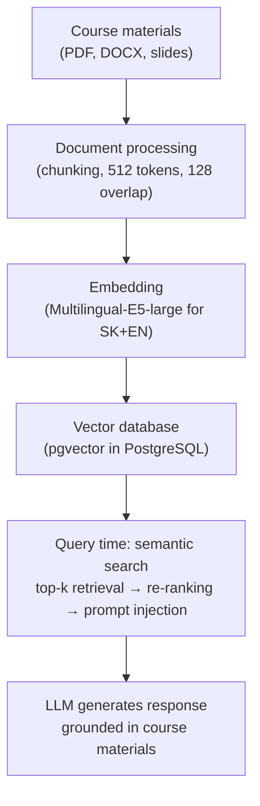
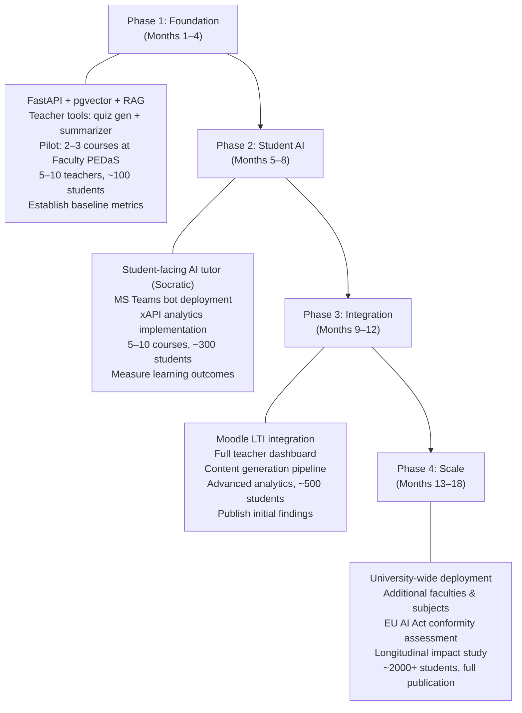

# 09 — Recommendations for VzdelAI Platform Design

> Specific, actionable recommendations for the VzdelAI platform, mapped to project outputs and backed by research findings.

---

## 1. RAG-Based Architecture

### Recommendation

Adopt **Retrieval-Augmented Generation (RAG)** as the core architectural pattern for all AI interactions.

### Evidence

| Source | Finding |
|--------|---------|
| LPITutor (PeerJ, 2025) | RAG improved accuracy from 72% to **94%** — a 30.5% improvement |
| Jill Watson (Georgia Tech) | Domain-specific knowledge-based system outperforms generic ChatGPT in classrooms |
| NotebookLM (Google) | Source-grounded RAG eliminates hallucination by design |
| Open TutorAI (2026) | Dual knowledge base (curated + user-uploaded) provides flexibility |

### Implementation

### Technology Choices

| Component | Choice | Justification |
|-----------|--------|---------------|
| **Embedding model** | Multilingual-E5-large | Supports Slovak + English; runs locally; free |
| **Vector database** | pgvector (PostgreSQL extension) | Single database for all data; simpler ops; adequate for initial scale |
| **Chunking** | Recursive text splitting, 512 tokens, 128 overlap | Standard approach; proven in LPITutor |
| **Retrieval** | Hybrid search (dense + BM25) with cross-encoder re-ranking | Best precision for educational content |
| **Framework** | LlamaIndex | Purpose-built for RAG; excellent document loaders; Python-native |

→ *Full technical details:* [03-technical-architecture.md](03-technical-architecture.md)

---

## 2. Hybrid LLM Strategy

### Recommendation

Deploy a **hybrid LLM strategy** combining cloud APIs for production quality with local models for development, testing, and privacy-sensitive workloads.

### Configuration

| Environment | LLM Provider | Model | Purpose |
|-------------|-------------|-------|---------|
| **Production** | Azure OpenAI (EU West region) | GPT-4o / GPT-4 | Highest quality responses; EU data residency |
| **Development** | Ollama (local) | LLaMA 3 8B | Cost-free development and testing |
| **Privacy-sensitive** | Ollama (local) | LLaMA 3 70B (quantized) | Workloads where data must not leave university |
| **Fallback** | Ollama (local) | Mistral 7B | Service continuity if cloud API unavailable |

### Justification

| Factor | Cloud (Azure OpenAI) | Local (Ollama) |
|--------|---------------------|----------------|
| **Response quality** | Excellent (GPT-4) | Good (LLaMA 3 8B) to Very Good (70B) |
| **Data sovereignty** | EU data residency (Azure West Europe) | Full — no data leaves university |
| **Cost** | Per-token API costs | One-time GPU hardware investment |
| **Scalability** | Elastic (pay-per-use) | Limited by hardware |
| **Availability** | Microsoft SLA (99.9%) | Depends on university infrastructure |
| **GDPR compliance** | Via Microsoft DPA + EU region | Inherently compliant (local) |

### Cost Estimation

| Scenario | Monthly Cost (est.) |
|----------|-------------------|
| 500 students × 20 queries/week × Azure OpenAI GPT-4o | ~€200–400/month |
| 500 students × 20 queries/week × local LLaMA 3 8B | €0 API cost (+ hardware amortization) |
| Hybrid (80% local, 20% cloud for complex queries) | ~€50–100/month |

---

## 3. MS Teams as Primary Delivery Channel

### Recommendation

Deploy VzdelAI as a **Microsoft Teams bot** as the primary user interface, supplemented by a **standalone web application** for full-featured access.

### Rationale

| Factor | Justification |
|--------|---------------|
| **User adoption** | Students and teachers already use Teams daily — no new app to adopt |
| **Institutional alignment** | University of Žilina uses Microsoft 365 for Education |
| **Contextual access** | Bot can access class information via Graph API |
| **Rich interactions** | Adaptive Cards for quizzes, feedback, and reports |
| **Notifications** | Proactive messaging for study reminders and assignments |
| **Coexistence** | Works alongside Copilot for Education (complementary, not competing) |

### Dual-Interface Strategy

| Interface | Use Case | Technology |
|-----------|----------|------------|
| **Teams Bot** | Quick Q&A, daily tutoring, notifications, quizzes | Azure Bot Framework (Python SDK) |
| **Web Application** | Dashboard, analytics, content management, teacher tools | Next.js (React) |

→ *Full MS Teams analysis:* [04-ms-teams-integration.md](04-ms-teams-integration.md)

---

## 4. Moodle/LMS Integration via LTI

### Recommendation

Implement **LTI 1.3** integration to embed VzdelAI within Moodle (or any LTI-compliant LMS).

### Implementation Plan

| Component | Description |
|-----------|-------------|
| **LTI Tool Provider** | VzdelAI exposes LTI 1.3 endpoints for launch and grade passback |
| **Course context** | LTI launch passes course ID, user role, enabling course-specific RAG |
| **Grade passback** | Assessment Grades Service (AGS) for returning quiz/exercise scores to Moodle gradebook |
| **Deep linking** | Teachers can add VzdelAI links to specific topics within Moodle courses |

### Additionally: Moodle AI Provider Plugin

| Component | Description |
|-----------|-------------|
| **Custom AI provider** | Moodle 4.5+ AI subsystem plugin routing requests to VzdelAI backend |
| **In-Moodle AI** | Text generation, summarization, and question generation powered by VzdelAI's RAG pipeline |
| **Transparent integration** | Teachers use familiar Moodle interface; VzdelAI works behind the scenes |

→ *Full LMS analysis:* [05-open-source-tools.md](05-open-source-tools.md)

---

## 5. Pedagogical Guardrails: Socratic Approach

### Recommendation

Implement **Socratic questioning** as the default pedagogical strategy for student-facing AI interactions, following the Khanmigo pattern.

### Prompt Engineering Strategy

Adopt Open TutorAI's **four-layer prompting** system:

| Layer | Content |
|-------|---------|
| **1. Global Context** | "You are VzdelAI, an educational AI assistant for University of Žilina. You never give direct answers to homework/exam questions. You use the Socratic method to guide students to understanding." |
| **2. Instructional Logic** | Course-specific pedagogical strategy: scaffolding level, vocabulary level, explanation style (per subject/teacher preference) |
| **3. Adaptive Variables** | Student proficiency level (derived from interaction history), preferred explanation style, session context |
| **4. Post-Interaction** | Reflection prompts ("What did you learn?"), self-assessment triggers, study recommendations |

### Guardrail Examples

| Scenario | AI Behavior |
|----------|------------|
| Student asks for homework answer | "What do you think the answer is? Let's work through it step by step." |
| Student asks about exam content | "I can help you understand the concepts. What specific topic are you finding challenging?" |
| Student submits incorrect reasoning | "Interesting approach! Let's check: if X is true, what would that mean for Y?" |
| Student demonstrates understanding | "Excellent reasoning! You've grasped the key concept. Want to try a harder problem?" |
| Question outside course scope | "That's an interesting question, but it's outside our course material. You might find answers in [source]." |

---

## 6. xAPI for Learning Analytics

### Recommendation

Implement **xAPI (Experience API)** for comprehensive learning analytics tracking across all VzdelAI interactions.

### Tracked Events

| Event Category | xAPI Verb | Data Captured |
|---------------|-----------|---------------|
| Student asks question | `asked` | Topic, difficulty inferred, course context |
| AI provides response | `responded` | Response quality score, RAG sources used, confidence |
| Student completes quiz | `completed` | Score, time taken, topics tested |
| Student requests hint | `interacted` | Hint level (1–4), topic |
| Teacher generates content | `created` | Content type, subject, generation parameters |
| Student session duration | `experienced` | Duration, engagement level |

### Analytics Dashboards

| Dashboard | Audience | Metrics |
|-----------|----------|---------|
| **Student Dashboard** | Students | Personal progress, knowledge gaps, study recommendations |
| **Teacher Dashboard** | Teachers | Class overview, common misconceptions, at-risk students |
| **Admin Dashboard** | Administrators | Platform usage, cost metrics, compliance reporting |
| **Research Dashboard** | Researchers | Anonymized aggregate data for publications |

### Learning Record Store

| Option | Description | Recommendation |
|--------|-------------|----------------|
| **Learning Locker** | Open-source LRS | Good for self-hosted deployment |
| **Custom LRS** | Built into VzdelAI backend | Simpler architecture; full control |
| **Cloud LRS** | Managed service (Watershed, etc.) | Lower maintenance; higher cost |

**Recommendation:** Custom LRS within VzdelAI's PostgreSQL database for initial deployment; migrate to dedicated LRS if scale requires.

---

## 7. EU AI Act Compliance by Design

### Recommendation

Build compliance into VzdelAI's architecture from the start rather than retrofitting.

### Compliance-by-Design Features

| AI Act Requirement | Built-In Feature |
|-------------------|-----------------|
| **Risk management** | Risk assessment documentation; automated risk metric tracking |
| **Data governance** | Curated knowledge bases with expert review workflow |
| **Technical documentation** | Architecture docs auto-generated from codebase; decision logs |
| **Logging** | xAPI event logging covers Art. 12 requirements |
| **Human oversight** | Teacher review required for AI-generated assessments; override capability |
| **Transparency** | Source citations; confidence scores; "I don't know" responses |
| **Accuracy** | RAG architecture; regular accuracy benchmarking |
| **Cybersecurity** | RBAC, encryption, audit trails |
| **Conformity** | Self-assessment checklist built into admin panel |

### Timeline Alignment

| VzdelAI Phase | AI Act Milestone |
|---------------|-----------------|
| Development (2025–2026) | Build compliance features |
| Pilot (2026–2027) | Test and document compliance |
| Deployment (2027) | Conformity self-assessment complete before Aug 2027 deadline |

→ *Full regulatory analysis:* [07-regulatory-compliance.md](07-regulatory-compliance.md)

---

## 8. Open-Source Components

### Recommendation

Leverage open-source components wherever possible to reduce development time, cost, and vendor lock-in.

### Recommended Open-Source Stack

| Component | Open-Source Choice | Alternative |
|-----------|-------------------|-------------|
| **Chat UI reference** | OpenWebUI | Custom React components |
| **RAG framework** | LlamaIndex | LangChain |
| **Local LLM** | Ollama | vLLM |
| **Vector search** | pgvector | Qdrant |
| **Backend** | FastAPI | Django |
| **Frontend** | Next.js | SvelteKit |
| **Monitoring** | Prometheus + Grafana | Datadog |
| **Logging** | Loki | ELK Stack |
| **Content creation** | H5P | Custom |
| **Agent orchestration** | LangGraph | Custom |

### Reference Implementations

| Project | What to Borrow |
|---------|---------------|
| **Open TutorAI** | 4-layer prompting, dual knowledge base, RBAC design |
| **Moodle AI** | Provider plugin architecture, per-task model selection |
| **AI-Tutor (GitHub)** | RAG pipeline patterns for educational use |
| **LPITutor** | Dual-layer prompting, evaluation methodology |

→ *Full open-source analysis:* [05-open-source-tools.md](05-open-source-tools.md)

---

## 9. Teacher-Facing Tools Priority

### Recommendation

Launch **teacher-facing tools first**, before student-facing AI tutoring.

### Rationale

| Reason | Explanation |
|--------|-------------|
| **Faculty buy-in** | Teachers who benefit from AI become advocates for broader deployment |
| **Lower risk** | Teacher-reviewed content has human oversight built in |
| **Demonstrable time savings** | ~5.9 hours/week savings creates immediate value |
| **Content foundation** | Teacher-uploaded materials build the RAG knowledge base for student features |
| **Regulatory simplicity** | Teacher tools may not trigger high-risk classification (depending on use) |

### Teacher Tool Priority

| Priority | Tool | Description | Impact |
|----------|------|-------------|--------|
| **P1** | Quiz/question generator | Generate quiz questions from uploaded materials | High (saves assessment creation time) |
| **P1** | Content summarizer | Summarize lecture notes, papers, textbooks | High (quick review materials for students) |
| **P2** | Lesson plan assistant | AI-assisted lesson planning from curriculum goals | Medium-High |
| **P2** | Presentation generator | Create slide decks from content | Medium |
| **P3** | Grading assistant | AI-assisted rubric application for written assignments | Medium (requires careful accuracy validation) |
| **P3** | Student Q&A analyzer | Identify common questions/misconceptions from student interactions | Medium |

---

## 10. Phased Rollout

### Recommendation

Implement a **phased rollout** starting with Faculty PEDaS and expanding based on evidence.

### Rollout Plan

### Success Metrics per Phase

| Phase | Key Metrics |
|-------|-------------|
| **Phase 1** | Teacher satisfaction >4/5; content quality validated by experts; time savings measured |
| **Phase 2** | Student engagement rates; learning outcome comparison (AI vs. control); RAG accuracy >90% |
| **Phase 3** | LMS integration functioning; analytics dashboard operational; faculty adoption rate >30% |
| **Phase 4** | University-wide adoption; AI Act compliance confirmed; research publications submitted |

---

## Summary: Technology Stack Decision Matrix

| Component | Recommendation | Reasoning |
|-----------|---------------|-----------|
| **Core Backend** | FastAPI (Python) | Async performance; excellent AI/ML ecosystem; type hints |
| **RAG Framework** | LlamaIndex | Purpose-built for RAG; document loaders; Python-native |
| **Agent Orchestration** | LangGraph | Stateful multi-agent workflows for complex pedagogical interactions |
| **LLM (Production)** | Azure OpenAI GPT-4o | Best quality; EU data residency; Microsoft DPA |
| **LLM (Development)** | Ollama + LLaMA 3 8B | Free; fast iteration; no API costs |
| **LLM (Privacy)** | Ollama + LLaMA 3 70B (Q4) | Full data sovereignty for sensitive workloads |
| **Embedding** | Multilingual-E5-large | Slovak + English; local; free |
| **Vector DB** | pgvector (PostgreSQL) | Single DB; simple ops; adequate scale |
| **App Database** | PostgreSQL | Industry standard; pgvector extension |
| **Cache** | Redis | Session management; pub/sub; rate limiting |
| **Frontend** | Next.js (React) | SSR; large ecosystem; good for dashboards |
| **Teams Bot** | Azure Bot Framework (Python) | Native Teams integration; Graph API access |
| **LMS Integration** | LTI 1.3 | Universal LMS compatibility |
| **Learning Analytics** | xAPI + custom LRS | Standardized tracking; EU AI Act logging |
| **Content Standard** | H5P for interactive content | Open-source; Moodle compatible |
| **Deployment** | Docker Compose → Kubernetes | Start simple; scale when needed |
| **CI/CD** | GitHub Actions | Standard; university-compatible |
| **Monitoring** | Prometheus + Grafana | Open-source; comprehensive |

---

## References

- All references from research documents [01](01-executive-summary.md)–[08](08-challenges-risks.md)
- See individual research documents for detailed source citations
- → [Component Mapping](../planning/component-mapping.md) for mapping to project outputs
