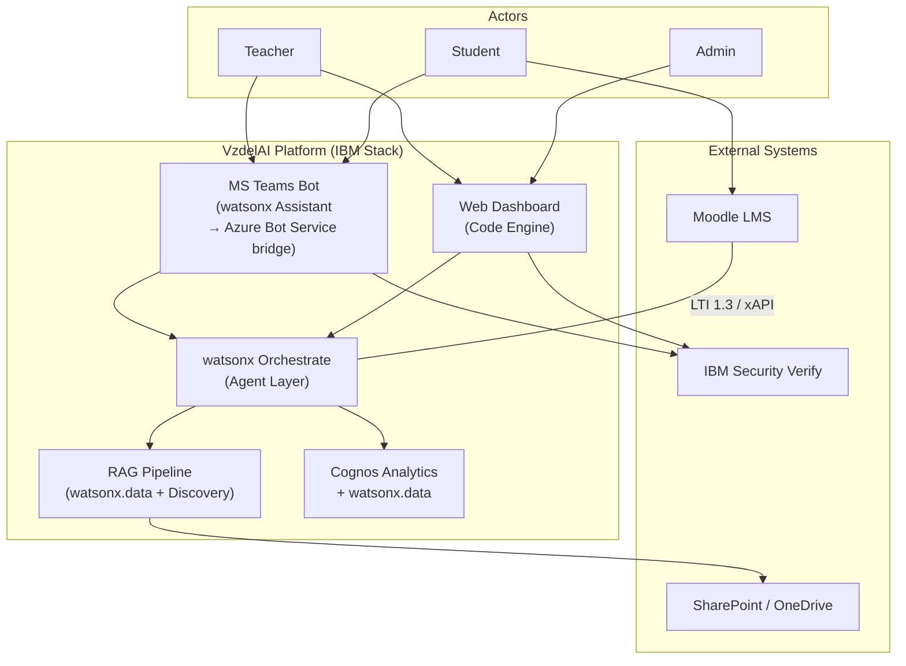
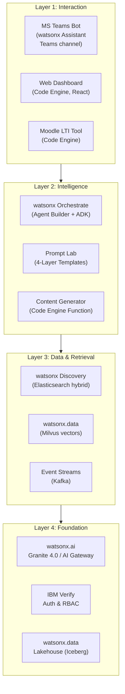
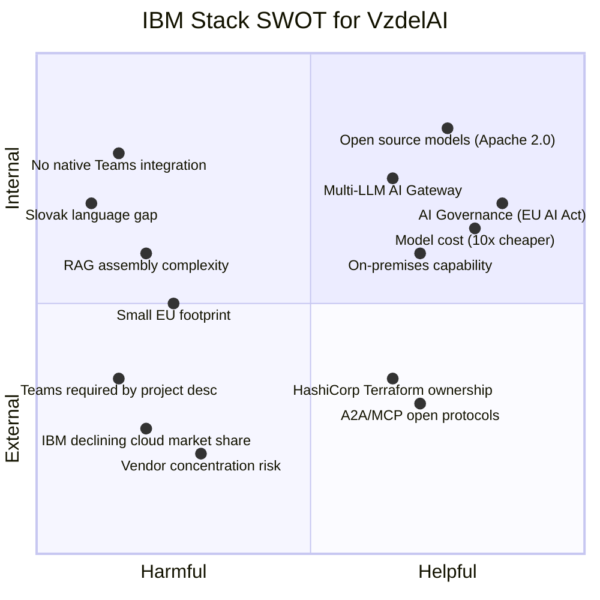

# 03c — IBM Stack Analysis & SWOT Comparison

> Deep analysis of IBM's watsonx platform as an alternative stack for VzdelAI, compared against the Microsoft-native architecture defined in [[research/03-technical-architecture]]. Includes an IBM-native technical architecture, service-by-service comparison, and SWOT analysis.

> [!note] Purpose
> This document evaluates what the VzdelAI platform would look like if built entirely on IBM's stack. It is **not a recommendation to switch** — the project description commits to Microsoft (§5.7). This analysis serves as:
> 1. A due-diligence comparison for the consortium
> 2. Evidence-based justification for the Microsoft-native decision
> 3. Identification of IBM capabilities that could complement the Microsoft stack

---

## 1. IBM watsonx Platform Overview (Feb 2026)

IBM's AI platform consists of four pillars:

| Pillar | Service | Purpose | Status |
|--------|---------|---------|--------|
| **AI Studio** | watsonx.ai | Model training, fine-tuning, inference, prompt lab, AutoAI for RAG | GA |
| **Data Lakehouse** | watsonx.data | Open lakehouse (Apache Iceberg), integrated Milvus vector DB | GA |
| **AI Governance** | watsonx.governance | Risk management, EU AI Act compliance, model lifecycle | GA |
| **Agent Orchestration** | watsonx Orchestrate | Multi-agent orchestration, AI Gateway, Agent Builder | GA |

Supporting services:

| Service | Purpose | Status |
|---------|---------|--------|
| watsonx Assistant | Conversational AI (virtual agents, dialog management) | GA |
| Watson Discovery (watsonx Discovery) | Enterprise search, NLP-enriched retrieval (Elasticsearch-powered) | GA |
| IBM Cloud Code Engine | Serverless compute (apps, jobs, functions) | GA |
| IBM Event Streams | Managed Apache Kafka | GA |
| IBM Security Verify | Enterprise IAM (SSO, MFA, FIDO2, governance) | GA |
| IBM Cognos Analytics | BI dashboards, AI-powered reporting | GA (v12.1.1) |
| IBM Instana | Observability, GenAI monitoring | GA |

### Key Differentiators vs. Microsoft

| Dimension | IBM watsonx | Microsoft Azure AI |
|-----------|------------|-------------------|
| **Open source commitment** | Granite models (Apache 2.0), Milvus, BeeAI (Linux Foundation), Iceberg | Mostly proprietary services; some OSS (Semantic Kernel MIT) |
| **Hybrid deployment** | SaaS + Red Hat OpenShift + VMware on-premises | Azure-only (limited Azure Arc options) |
| **Model flexibility** | AI Gateway: watsonx, OpenAI, Anthropic, Google, Mistral, Ollama | Primarily Azure OpenAI; expanding via AI Model Catalog |
| **AI governance** | Dedicated product (watsonx.governance) — EU AI Act accelerators | Azure AI Content Safety + custom implementation |
| **Collaboration platform** | None (sold to HCL in 2019) | Microsoft Teams (native, first-party) |
| **Enterprise ecosystem** | Strong in regulated industries (banking, healthcare, government) | Dominant in education, productivity, developer tools |

---

## 2. IBM-Native Technical Architecture for VzdelAI

> [!warning] Hypothetical Architecture
> This section describes what VzdelAI would look like if built entirely on IBM's stack, mapping every component from the [[research/03-technical-architecture|Microsoft-native architecture]] to its IBM equivalent.

### 2.1 Technology Stack Mapping: Microsoft → IBM

| VzdelAI Component | Microsoft-Native (Current) | IBM-Native (Hypothetical) |
|-------------------|---------------------------|--------------------------|
| **LLM (production)** | Azure OpenAI GPT-4.1 / GPT-4o | watsonx.ai: Granite 4.0 H-Small (32B) + Llama 4 Maverick via AI Gateway |
| **LLM (reasoning)** | Azure OpenAI o3-mini | watsonx.ai: o3-mini via AI Gateway (OpenAI pass-through) |
| **LLM (local dev)** | Ollama (Phi-4 / LLaMA 3 8B) | Ollama (Granite / LLaMA 3 8B) — same approach |
| **Embedding model** | Azure OpenAI text-embedding-3-large | watsonx.ai: granite-embedding-278m-multilingual (768d) or multilingual-e5-large (1024d) |
| **Vector database** | Azure AI Search (integrated vectorization) | watsonx.data: Milvus (managed) |
| **Hybrid search** | Azure AI Search (native vector + BM25) | watsonx Discovery (Elasticsearch: dense + sparse + BM25) |
| **Reranking** | Azure AI Search Semantic Ranker | cross-encoder/ms-marco-minilm-l-12-v2 (watsonx.ai) |
| **Document ingestion** | AI Search integrated vectorization (skillset) | watsonx.data: prebuilt operators (chunking, embedding) + Docling + Data Prep Kit |
| **OCR** | AI Search OCR skill (built-in) | Watson Document Understanding |
| **Agent orchestration** | Foundry Agent Service | watsonx Orchestrate (Agent Builder + ADK) |
| **Agent framework** | Microsoft Agent Framework (Semantic Kernel) | BeeAI Framework (open source, Linux Foundation) |
| **Prompt management** | Custom (Cosmos DB + SK templates) | watsonx.ai Prompt Lab (versioned templates, variable substitution) |
| **Conversational AI** | Copilot Studio + Bot Framework | watsonx Assistant (Actions + Conversational Search) |
| **Teams bot** | Azure Bot Service + Teams AI Library (native) | watsonx Assistant Teams channel (via Azure Bot Service bridge) |
| **Web dashboard** | Azure App Service (React) | IBM Cloud Code Engine (React) |
| **LTI provider** | Azure App Service (custom) | IBM Cloud Code Engine (custom) — same effort |
| **Identity & SSO** | Microsoft Entra ID (native Teams SSO) | IBM Security Verify + Entra ID bridge (for Teams) |
| **Telemetry stream** | Azure Event Hubs | IBM Event Streams (managed Kafka) |
| **Data lakehouse** | Microsoft Fabric (Delta Lake) | watsonx.data (Apache Iceberg, Presto, Spark) |
| **BI dashboards** | Power BI (embedded) | IBM Cognos Analytics (JavaScript SDK embedding) |
| **Compliance logging** | Immutable Blob Storage | IBM Cloud Object Storage (Object Lock / WORM) |
| **CI/CD** | Azure DevOps Pipelines | IBM Cloud Continuous Delivery (Tekton) |
| **IaC** | Bicep templates | Terraform (IBM owns HashiCorp) |
| **Secret management** | Azure Key Vault | HashiCorp Vault (IBM-owned) |
| **Observability** | Azure Monitor + Application Insights | IBM Instana (GenAI Observability) |
| **AI governance** | Custom (Azure AI Content Safety) | watsonx.governance (dedicated product) |

### 2.2 IBM-Native System Context

### 2.3 IBM-Native Four-Layer Decomposition

### 2.4 IBM-Native RAG Pipeline

```mermaid
flowchart LR
    subgraph sources_ibm["Document Sources"]
        sp_ibm["SharePoint<br>OneDrive"]
        moodle_files_ibm["Moodle<br>Course Files"]
        upload_ibm["Manual<br>Upload"]
    end

    subgraph ingest_ibm["watsonx.data Ingestion"]
        docling["Docling<br>(Document Parsing)"]
        chunking["Data Prep Kit<br>(Chunking + Enrichment)"]
        embedder_ibm["Granite Embedding<br>278m-multilingual"]
        milvus["Milvus<br>(Vector Index)"]
    end

    subgraph query_ibm["Query Time"]
        user_q_ibm["User Query"]
        q_embed_ibm["Query Embedding"]
        hybrid_ibm["watsonx Discovery<br>Hybrid Search<br>(Dense + ELSER + BM25)"]
        rerank_ibm["Cross-Encoder<br>Reranker"]
        context_ibm["Top-k Chunks<br>+ Citations"]
    end

    subgraph gen_ibm["Augmented Generation"]
        prompt_ibm["Prompt Lab<br>4-Layer Assembly"]
        llm_gen["watsonx.ai<br>Granite 4.0 / Llama 4"]
        response_ibm["Cited Response"]
    end

    sources_ibm --> docling --> chunking --> embedder_ibm --> milvus
    user_q_ibm --> q_embed_ibm --> hybrid_ibm --> rerank_ibm --> context_ibm --> prompt_ibm --> llm_gen --> response_ibm
    milvus -.->|indexed vectors| hybrid_ibm
```

> [!danger] Critical Difference: RAG Pipeline Effort
> **Microsoft:** AI Search integrated vectorization handles parsing, chunking, embedding, and indexing as a single config-driven skillset. ~80% less custom code.
> **IBM:** Requires assembling Docling + Data Prep Kit + Milvus + watsonx Discovery as separate components. More flexible but significantly more engineering effort to build, test, and maintain the pipeline.

---

## 3. Service-by-Service Comparison

### 3.1 LLM Foundation

| Criterion | Microsoft (Azure OpenAI) | IBM (watsonx.ai) |
|-----------|-------------------------|-------------------|
| **Frontier models** | GPT-4.1, GPT-4o, o3-mini, o1 | Granite 4.0 H-Small (32B MoE), Llama 4, Mistral Large |
| **Model quality (general)** | Industry-leading (GPT-4.1) | Granite competitive in <100B class; not frontier-level |
| **Slovak language** | GPT-4.1 significantly improved multilingual | Granite supports 12 languages — **Slovak NOT listed** (Czech is) |
| **Reasoning** | o3-mini, o1 (dedicated reasoning models) | No IBM-native reasoning model; can access o3-mini via AI Gateway |
| **Multimodal** | GPT-4o (vision + audio) | Granite Vision 3.2 (images only) |
| **Open source** | None (proprietary API-only) | Granite models Apache 2.0 (self-hostable) |
| **Fine-tuning** | Supported (Azure OpenAI fine-tuning) | Supported (Tuning Studio, InstructLab) |
| **On-premises** | Not available | Ollama, Red Hat OpenShift |
| **Pricing** | Provisioned throughput + pay-per-token | Significantly cheaper (Granite ~10x lower per-token than GPT-4.1) |
| **Verdict** | Superior quality, especially for Slovak | More flexible, cheaper, open source, but weaker Slovak support |

> [!warning] Slovak Language — Critical Gap for IBM
> Granite models list 12 supported languages: English, German, Spanish, French, Japanese, Portuguese, Arabic, **Czech**, Italian, Korean, Dutch, Chinese. **Slovak is absent.** Czech and Slovak share ~95% mutual intelligibility, so Granite may perform acceptably, but this is unvalidated and a significant risk for production educational content in Slovak. Azure OpenAI's GPT-4.1 handles Slovak with significantly better quality.

### 3.2 Embedding & Vector Search

| Criterion | Microsoft (Azure AI Search) | IBM (watsonx.data + watsonx.ai) |
|-----------|---------------------------|-------------------------------|
| **Embedding model** | text-embedding-3-large (3072d, API-only) | granite-embedding-278m-multilingual (768d, Apache 2.0) |
| **MTEB score** | ~64.6 (market-leading) | ~56.1 (competitive for size class) |
| **Vector database** | Azure AI Search (managed) | Milvus in watsonx.data (managed) |
| **Max vectors** | Virtually unlimited (tier-based) | 100M vectors × 384d (initial limits) |
| **Hybrid search** | Native (vector + BM25) | Elasticsearch (dense + ELSER + BM25) via watsonx Discovery |
| **Integrated vectorization** | Yes (config-driven skillset: parse → chunk → embed → index) | No — assemble from Docling + Data Prep Kit + Milvus |
| **Reranking** | Semantic Ranker (built-in L2) | Cross-encoder (hosted in watsonx.ai) |
| **Security filters** | Native per-document ACL filters | Custom implementation on Milvus metadata |
| **Slovak analyzer** | Built-in Slovak language analyzer for BM25 | Not documented for Elasticsearch on IBM Cloud |
| **Effort** | Low (config-driven) | Medium-High (assembly required) |
| **Verdict** | More mature, lower effort, better Slovak support | More flexible, open-source, cheaper, but more work |

### 3.3 Agent Orchestration

| Criterion | Microsoft (Foundry Agent Service) | IBM (watsonx Orchestrate) |
|-----------|----------------------------------|--------------------------|
| **Agent builder** | Copilot Studio (no-code) + Agent Framework SDK (C#/Python) | Agent Builder (no-code) + ADK (Python/CLI) + Langflow (visual) |
| **Multi-agent** | Microsoft Agent Framework (AutoGen + Semantic Kernel merger) | Built-in orchestrator agent + Agentic Workflows (GA) |
| **Tool ecosystem** | 1,400+ Power Platform connectors | 400+ prebuilt tools, 80+ enterprise app integrations |
| **LLM routing** | Primarily Azure OpenAI | AI Gateway: watsonx, OpenAI, Anthropic, Google, Mistral, Ollama |
| **Governance** | Azure AI Content Safety | AgentOps (built-in governance, audit trails) |
| **Teams publishing** | Native one-click publishing | Via Azure Bot Service bridge (indirect) |
| **Open protocols** | Limited (proprietary) | MCP + A2A (open standards) |
| **On-premises** | No | Yes (Red Hat OpenShift) |
| **Maturity** | GA June 2025; Agent Framework GA Q1 2026 | GA; Agent Builder + Agentic Workflows GA 2025 |
| **Verdict** | Better Teams integration | More model-flexible, better governance, open protocols |

### 3.4 Conversational AI & Bot

| Criterion | Microsoft | IBM |
|-----------|----------|-----|
| **Platform** | Copilot Studio + Bot Framework + Teams AI Library | watsonx Assistant |
| **Teams integration** | Native, first-class (SSO, Adaptive Cards, proactive messaging, Graph API) | Via Azure Bot Service bridge (limited, no native SSO) |
| **Adaptive Cards** | Full support (rich, interactive) | Basic support via bridge (fallback text required) |
| **Proactive messaging** | Native Bot Framework capability | Requires custom development |
| **SSO** | Entra ID token exchange (seamless in Teams) | Requires separate IBM Verify + Entra ID bridge |
| **RAG integration** | Via Foundry Agent Service tools | Built-in Conversational Search (Watson Discovery) |
| **Channel breadth** | Teams-centric + web + Outlook | Web, phone, SMS, Slack, Teams, WhatsApp, Messenger |
| **On-premises** | No | Yes (Cloud Pak for Data / OpenShift) |
| **Verdict for VzdelAI** | **Clear winner** — Teams is the primary interface | Better multi-channel, but Teams integration is a second-class citizen |

### 3.5 Analytics & BI

| Criterion | Microsoft (Fabric + Power BI) | IBM (watsonx.data + Cognos) |
|-----------|------------------------------|---------------------------|
| **Unified platform** | Microsoft Fabric (one platform: ingestion → lakehouse → BI) | Separate products (watsonx.data + Cognos + Event Streams) |
| **Table format** | Delta Lake | Apache Iceberg |
| **Query engines** | Spark, KQL (Real-Time Analytics) | Presto, Presto C++, Spark |
| **BI tool** | Power BI (market leader in self-service BI) | Cognos Analytics (strong in enterprise reporting) |
| **Teams embedding** | Native Power BI Teams tab | No native Teams embedding |
| **Row-level security** | Integrated with Entra ID groups | Cognos RBAC (separate from IAM) |
| **Real-time analytics** | KQL Database (near real-time) | Event Streams + Presto (streaming via Kafka) |
| **AI-powered analytics** | Copilot in Power BI | Cognos AI Assistant |
| **Pricing** | Capacity-based (Fabric CU) | Consumption-based (watsonx.data) + per-user (Cognos) |
| **Verdict** | More unified, better Teams integration, larger community | Stronger enterprise reporting, open data formats |

### 3.6 Identity & Access Management

| Criterion | Microsoft (Entra ID) | IBM (Security Verify) |
|-----------|---------------------|----------------------|
| **Teams SSO** | Native token exchange | Not supported natively |
| **M365 integration** | Seamless (same identity fabric) | Requires federation config |
| **OIDC / OAuth 2.0** | Full support | Full support |
| **FIDO2 / Passwordless** | Yes | Yes |
| **Conditional access** | Yes (risk-based) | Yes (AI-powered adaptive) |
| **On-premises bridge** | Azure AD Connect | IBM Verify on-premises |
| **Governance** | Entra ID Governance | IBM Verify Governance (IGA + PAM) |
| **Moodle integration** | Moodle Microsoft 365 plugin (mature) | Custom SAML/OIDC configuration |
| **Verdict for VzdelAI** | **Clear winner** — entire ecosystem is Entra-native | Stronger IGA/PAM, but no native Teams/M365 integration |

### 3.7 AI Governance & EU AI Act

| Criterion | Microsoft | IBM |
|-----------|----------|-----|
| **Dedicated product** | No single product — Azure AI Content Safety + custom + Purview | **watsonx.governance** (dedicated, GA) |
| **EU AI Act accelerators** | General compliance guidance | Pre-built compliance rules and workflows |
| **Risk monitoring** | Custom implementation | Pre-built risk thresholds (fairness, drift, bias, PII, toxicity) |
| **Model documentation** | Custom factsheets | Automated AI Factsheets |
| **Audit trails** | Custom Event Hubs + Blob | Built-in lifecycle audit |
| **Market recognition** | — | Leader in 2025 IDC MarketScape for AI Governance |
| **Verdict** | Requires more custom work | **IBM wins** — dedicated product with EU AI Act focus |

### 3.8 Infrastructure & DevOps

| Criterion | Microsoft (Azure) | IBM Cloud |
|-----------|-------------------|-----------|
| **EU regions** | 10+ European regions (incl. Poland Central, Austria) | 2 MZRs (Frankfurt, London); Warsaw single-zone |
| **CEE proximity** | Poland Central (~300km from Slovakia) | Frankfurt (~700km from Slovakia) |
| **Serverless compute** | Azure Functions + App Service | Code Engine (Kubernetes/Knative-based) |
| **IaC** | Bicep (Azure-native) | Terraform (IBM owns HashiCorp) |
| **CI/CD** | Azure DevOps (integrated ALM) | Continuous Delivery (Tekton); no integrated ALM |
| **Secret management** | Azure Key Vault | HashiCorp Vault (IBM-owned) |
| **Container registry** | Azure Container Registry | IBM Container Registry |
| **Academic pricing** | Azure for Education (generous credits) | Limited academic programs |
| **Market share** | #2 cloud (~25%) | #5+ cloud (~3%) |
| **Verdict** | Better EU coverage, integrated DevOps, academic pricing | Terraform/Vault ownership, open-source aligned |

---

## 4. What Changes with IBM Stack

### 4.1 What Gets Easier

| Area | Why IBM Is Easier |
|------|------------------|
| **AI governance / EU AI Act** | watsonx.governance is a dedicated product with pre-built EU AI Act compliance accelerators; Microsoft requires custom implementation |
| **Model cost control** | Granite models are ~10x cheaper per token than GPT-4.1; open-source models can be self-hosted on OpenShift for zero per-token cost |
| **LLM vendor flexibility** | AI Gateway routes to watsonx, OpenAI, Anthropic, Google, Mistral, Ollama — no vendor lock-in |
| **On-premises deployment** | Full stack runs on Red Hat OpenShift; addresses data sovereignty concerns without cloud dependency |
| **Infrastructure as Code** | IBM owns Terraform (HashiCorp) — first-class Terraform support across all clouds |
| **Agent protocol standards** | A2A (Agent-to-Agent) and MCP support via BeeAI; future-proof agent interoperability |

### 4.2 What Gets Harder

| Area | Why IBM Is Harder | Impact |
|------|------------------|--------|
| **Teams integration** | No native Teams bot; requires Azure Bot Service bridge middleware | **Critical** — Teams is the primary interface |
| **Teams SSO** | No native Entra ID token exchange; requires IBM Verify ↔ Entra ID federation + custom token handling | **High** — every user interaction requires auth |
| **RAG pipeline** | No integrated vectorization; must assemble Docling + Data Prep Kit + Milvus + Discovery | **High** — ~80% more code than Azure AI Search |
| **Slovak language** | Granite models don't list Slovak; unvalidated for production Slovak content | **Critical** — core project requirement |
| **Moodle SSO** | No Moodle Microsoft 365 plugin equivalent; custom SAML/OIDC | **Medium** — already custom work, but less ecosystem support |
| **Power BI equivalent** | Cognos doesn't embed natively in Teams; no Fabric-like unified platform | **Medium** — dashboard delivery is Act 4 core deliverable |
| **Ecosystem integration** | SharePoint, OneDrive, Graph API are Microsoft; accessing them from IBM requires cross-platform auth | **High** — M365 is the document source |
| **Academic pricing** | IBM Cloud has limited educational institution programs vs. Azure for Education | **Medium** — affects TCO over 36 months |
| **EU data residency** | Only 2 EU MZRs (Frankfurt, London) vs. Azure's 10+ including Poland Central | **Medium** — less flexibility for CEE data residency |

### 4.3 What Stays the Same

| Area | Notes |
|------|-------|
| **Moodle LTI 1.3** | Custom development on both platforms — no native LTI integration from either vendor |
| **xAPI telemetry** | Custom transformer on both platforms |
| **4-layer prompt assembly** | Custom orchestration logic on both platforms (Prompt Lab templates ≈ SK templates) |
| **Student model computation** | Custom ML work on both platforms (Fabric Notebooks ≈ watsonx.data Spark) |
| **Predictive models** | Custom development on both platforms |

---

## 5. SWOT Analysis: IBM Stack for VzdelAI

### 5.1 IBM Stack — SWOT

#### Strengths (Internal, Helpful)

| # | Strength | Detail |
|---|----------|--------|
| S1 | **Open-source models** | Granite (Apache 2.0) enables self-hosting, modification, fine-tuning without vendor dependency |
| S2 | **Dedicated AI governance** | watsonx.governance is the only dedicated AI governance product among hyperscalers — pre-built EU AI Act accelerators |
| S3 | **Cost-efficient LLMs** | Granite 4.0 H-Small: ~$0.00006/1K input tokens vs. GPT-4.1 ~$0.002/1K — **~33x cheaper** |
| S4 | **Multi-model AI Gateway** | Route to watsonx, OpenAI, Anthropic, Google, Mistral, Ollama — true model agnosticism |
| S5 | **Hybrid/on-premises deployment** | Full stack on Red Hat OpenShift — addresses strictest data sovereignty requirements |
| S6 | **Agent maturity** | watsonx Orchestrate GA with Agent Builder, Agentic Workflows, 400+ tools, 80+ integrations |
| S7 | **AutoAI for RAG** | Automated RAG pipeline optimization — tests multiple configurations and ranks by quality |

#### Weaknesses (Internal, Harmful)

| # | Weakness | Detail | Severity for VzdelAI |
|---|----------|--------|---------------------|
| W1 | **No native Teams integration** | watsonx Assistant Teams channel requires Azure Bot Service bridge; no SSO, limited Adaptive Cards, no proactive messaging | **Critical** |
| W2 | **Slovak language not supported** | Granite models list 12 languages — Slovak absent; Czech (closest) untested for Slovak educational content | **Critical** |
| W3 | **RAG pipeline assembly** | No integrated vectorization — Docling + Data Prep Kit + Milvus + Discovery must be assembled, tested, maintained | **High** |
| W4 | **Lower embedding quality** | granite-embedding-278m-multilingual MTEB: 56.1 vs. text-embedding-3-large: 64.6 — 13% lower retrieval accuracy | **High** |
| W5 | **No unified analytics platform** | watsonx.data + Cognos + Event Streams are separate products (vs. Microsoft Fabric as one platform) | **Medium** |
| W6 | **Limited EU regions** | 2 MZRs (Frankfurt, London) vs. Azure's 10+ European regions | **Medium** |
| W7 | **No M365 ecosystem** | Accessing SharePoint, OneDrive, Graph API from IBM stack requires cross-platform authentication | **High** |
| W8 | **Smaller community** | IBM Cloud ~3% market share; fewer tutorials, Stack Overflow answers, community extensions | **Medium** |

#### Opportunities (External, Helpful)

| # | Opportunity | Detail |
|---|------------|--------|
| O1 | **HashiCorp ecosystem** | IBM owns Terraform, Vault, Consul — IaC and secret management usable across any cloud, including Azure |
| O2 | **A2A / MCP open protocols** | BeeAI and watsonx Orchestrate support open agent protocols — future-proof for multi-vendor agent ecosystems |
| O3 | **Selective IBM adoption** | Use watsonx.governance for EU AI Act compliance alongside Microsoft stack (hybrid approach) |
| O4 | **Granite fine-tuning** | Apache 2.0 models can be fine-tuned for Slovak using university's own educational data |
| O5 | **Cost reduction** | For development/testing, self-hosted Granite on OpenShift eliminates per-token API costs |

#### Threats (External, Harmful)

| # | Threat | Detail |
|---|--------|--------|
| T1 | **Project description lock-in** | §5.7 commits to Microsoft-native stack — switching to IBM contradicts contractual commitments |
| T2 | **IBM Cloud market trajectory** | IBM Cloud has ~3% market share and declining; risk of service deprecations or reduced investment |
| T3 | **Partner skill sets** | Consortium partners (Aricoma, COMTEC, COMPOTE, ESMO) are aligned with Microsoft ecosystem — IBM would require retraining |
| T4 | **Double platform complexity** | If Teams + M365 must be used (project requirement), IBM adds a second platform rather than replacing Microsoft — increasing complexity |
| T5 | **Limited academic programs** | IBM has fewer educational institution pricing programs compared to Azure for Education |

### 5.2 SWOT Summary Matrix

| | **Helpful** | **Harmful** |
|---|------------|-------------|
| **Internal** | **Strengths:** Open-source models, AI governance, cost-efficient LLMs, multi-model gateway, hybrid deployment, agent maturity | **Weaknesses:** No Teams integration, Slovak gap, RAG assembly effort, lower embeddings, no unified analytics, limited EU regions, no M365 access |
| **External** | **Opportunities:** HashiCorp IaC, A2A open protocols, selective hybrid adoption, Granite fine-tuning, dev cost reduction | **Threats:** Project description lock-in, IBM market trajectory, partner skill gaps, double platform complexity, limited academic pricing |

---

## 6. Comparative Cost Estimation

> [!note] Rough Order of Magnitude
> These are directional estimates for a medium-scale educational AI deployment (~1,000 students, ~100 teachers, ~900 documents, ~5,000 interactions/day). Actual pricing requires IBM/Azure quotes.

| Cost Category | Microsoft Stack (Monthly) | IBM Stack (Monthly) | Notes |
|--------------|--------------------------|--------------------|----|
| **LLM inference** | ~$2,000–$4,000 (GPT-4.1 provisioned) | ~$200–$600 (Granite 4.0 H-Small) | IBM ~5–10x cheaper on LLM costs |
| **Embedding** | ~$50 (text-embedding-3-large) | ~$20 (granite-embedding-278m-multilingual) | Minor difference |
| **Vector DB / Search** | ~$250 (AI Search Standard S1) | ~$300–$500 (watsonx.data Milvus + Discovery) | IBM slightly more expensive (two services) |
| **Compute (apps)** | ~$150 (App Service B1/S1) | ~$100–$200 (Code Engine, scale-to-zero) | Comparable |
| **Event streaming** | ~$11 (Event Hubs Basic) | ~$100+ (Event Streams Standard) | IBM significantly more expensive |
| **Data lakehouse** | ~$500 (Fabric F2) | ~$400–$800 (watsonx.data) | Comparable |
| **BI dashboards** | ~$10/user (Power BI Pro) | Custom quote (Cognos) | Cognos likely more expensive per-user |
| **Identity** | Included with M365 E3/E5 | ~$3/user (IBM Verify) | Microsoft free if university has M365 |
| **AI governance** | Custom (no dedicated cost) | ~$1,175+ (watsonx.governance Standard) | IBM has a dedicated line item |
| **Total estimate** | **~$3,500–$5,500/mo** | **~$3,000–$5,000/mo** | Comparable; IBM cheaper on LLM, costlier elsewhere |

> [!warning] Hidden Cost: Engineering Effort
> IBM's lower LLM costs are offset by significantly higher engineering effort:
> - RAG pipeline assembly: +2–3 months development vs. Azure AI Search config
> - Teams bridge middleware: +1–2 months development + ongoing maintenance
> - M365 cross-platform auth: +1 month vs. native Entra ID
> - Slovak language validation: +1–2 months if Granite needs fine-tuning
> At ~€80/hr for senior Azure/IBM engineers, this represents €100k–€200k in additional development cost over the project lifetime.

---

## 7. Verdict & Recommendations

### 7.1 Should VzdelAI Switch to IBM?

**No.** The IBM stack is not suitable as the primary platform for VzdelAI for three critical reasons:

1. **Teams is the primary interface** — The project description mandates MS Teams as the delivery channel. IBM's Teams integration is a second-class citizen requiring bridge middleware, with no native SSO, limited Adaptive Cards, and no proactive messaging. This alone disqualifies IBM as the primary platform.

2. **Slovak language gap** — Granite models do not officially support Slovak. For an educational AI platform delivering content in Slovak to Slovak university students, this is an unacceptable risk. GPT-4.1's significantly better Slovak quality is a decisive advantage.

3. **M365 ecosystem dependency** — VzdelAI ingests documents from SharePoint/OneDrive, authenticates via Entra ID, and embeds dashboards in Teams. Using IBM would mean maintaining the entire Microsoft ecosystem *plus* IBM — doubling complexity without proportional benefit.

### 7.2 Where IBM Could Complement Microsoft

| IBM Capability | How It Could Complement Microsoft Stack | When to Consider |
|----------------|----------------------------------------|-----------------|
| **watsonx.governance** | EU AI Act compliance layer alongside Azure stack — dedicated governance product | If custom Azure compliance logging proves insufficient for EU AI Act audit (M2–M3) |
| **Granite models (OSS)** | Fine-tuned for Slovak on university data; used in local dev (Ollama) as drop-in for Azure OpenAI | If local development needs improve beyond Phi-4/LLaMA 3 quality |
| **Terraform (HashiCorp)** | IaC for Azure resources — Terraform is cloud-agnostic and IBM-owned | Immediately — Terraform is a valid alternative to Bicep |
| **HashiCorp Vault** | Secret management as alternative to Azure Key Vault — especially for multi-cloud scenarios | If project expands beyond Azure |
| **BeeAI A2A protocol** | Agent interoperability standard for future multi-vendor agent scenarios | Post-M4, when agent ecosystem matures |
| **AutoAI for RAG** | Evaluate RAG pipeline configurations — could benchmark against Azure AI Search | During M2 evaluation phase |

### 7.3 Final Recommendation

> [!tip] Recommendation
> **Maintain the Microsoft-native architecture** as defined in [[research/03-technical-architecture]]. The project description, partner skill sets, Teams requirement, Slovak language needs, and M365 ecosystem all align with Microsoft.
>
> **Adopt IBM selectively:**
> 1. **Terraform** for IaC (instead of or alongside Bicep) — §9 of architecture doc
> 2. **Evaluate watsonx.governance** for EU AI Act compliance during M2 — it may save significant custom development
> 3. **Evaluate Granite models** for local development and as a fine-tuning base for Slovak

---

## Cross-References

| Document | Relevance |
|----------|-----------|
| [[research/03-technical-architecture]] | Microsoft-native architecture (primary) |
| [[03b-ibm-cloud-infrastructure]] | IBM Cloud infrastructure research details |
| [[07-regulatory-compliance]] | EU AI Act requirements driving governance evaluation |
| [[08-challenges-risks]] | Risk mitigations for technology choices |
| [[02-platform-landscape]] | Competitive landscape |

---

## Research Sources

- IBM. (2026). *watsonx.ai Foundation Models*. https://www.ibm.com/products/watsonx-ai/foundation-models
- IBM. (2025). *Granite 4.0 Announcement*. https://www.ibm.com/new/announcements/ibm-granite-4-0-hyper-efficient-high-performance-hybrid-models
- IBM. (2025). *watsonx.data — Integrated Vector Database*. https://www.ibm.com/new/announcements/ibm-watsonx-data-vector-database-ai-ready-data-management
- IBM. (2025). *watsonx.governance*. https://www.ibm.com/products/watsonx-governance
- IBM. (2025). *watsonx Orchestrate*. https://www.ibm.com/products/watsonx-orchestrate
- IBM. (2025). *watsonx Assistant — Microsoft Teams Integration*. https://cloud.ibm.com/docs/watson-assistant?topic=watson-assistant-deploy-microsoft-teams
- IBM. (2025). *IBM Cloud Code Engine*. https://www.ibm.com/products/code-engine
- IBM. (2025). *IBM Security Verify*. https://www.ibm.com/products/verify
- IBM. (2025). *IBM Cognos Analytics*. https://www.ibm.com/products/cognos-analytics
- IBM. (2025). *IBM Instana — GenAI Observability*. https://www.ibm.com/products/instana
- IBM Research. (2025). *Granite Embedding Models*. https://arxiv.org/html/2502.20204v1
- IBM Research. (2025). *BeeAI Framework*. https://github.com/i-am-bee/beeai-framework
- Linux Foundation. (2025). *ACP Joins A2A Protocol*. https://lfaidata.foundation/
- Elastic. (2025). *IBM-Elastic Partnership for Conversational Search*. https://www.elastic.co/blog/ibm-elasticsearch-partnership-conversational-search-watsonx-assistant
