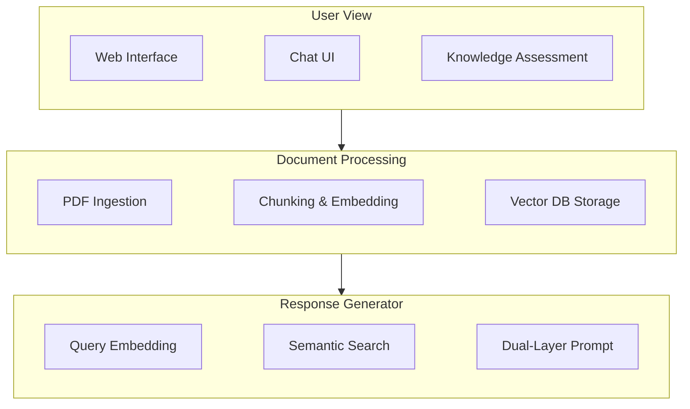
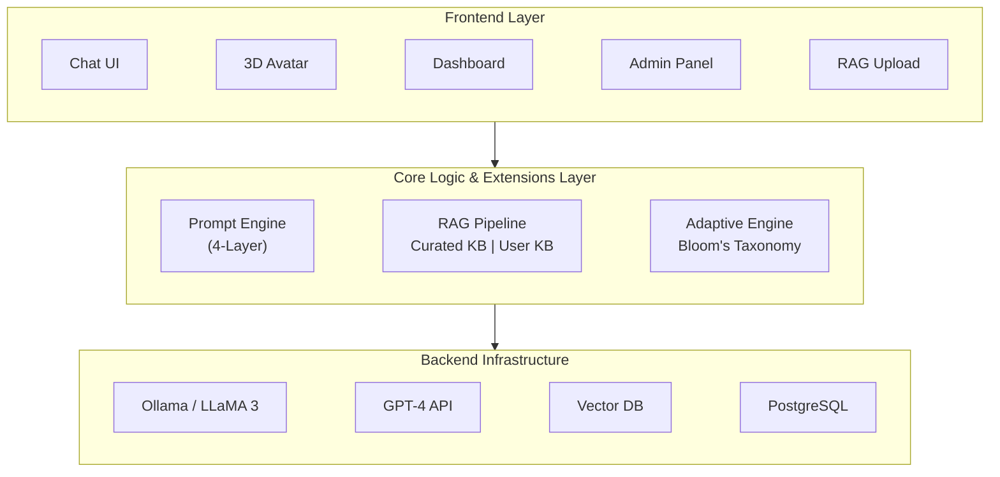
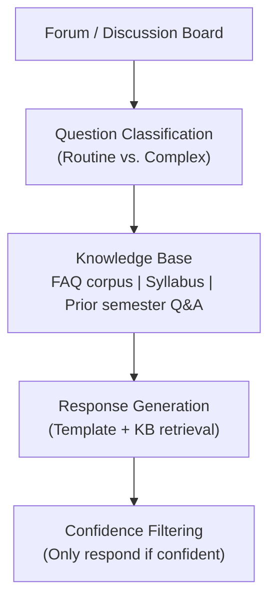
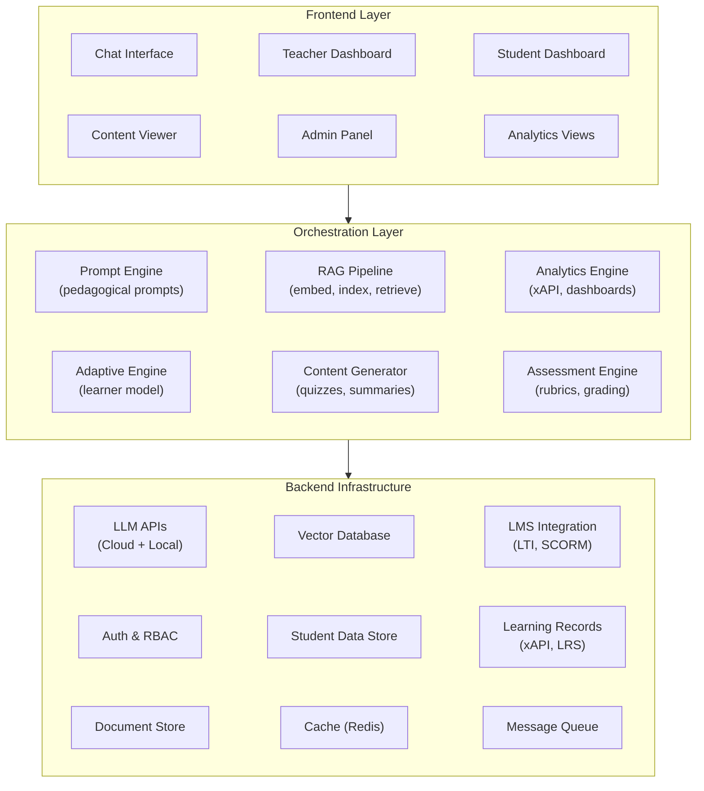
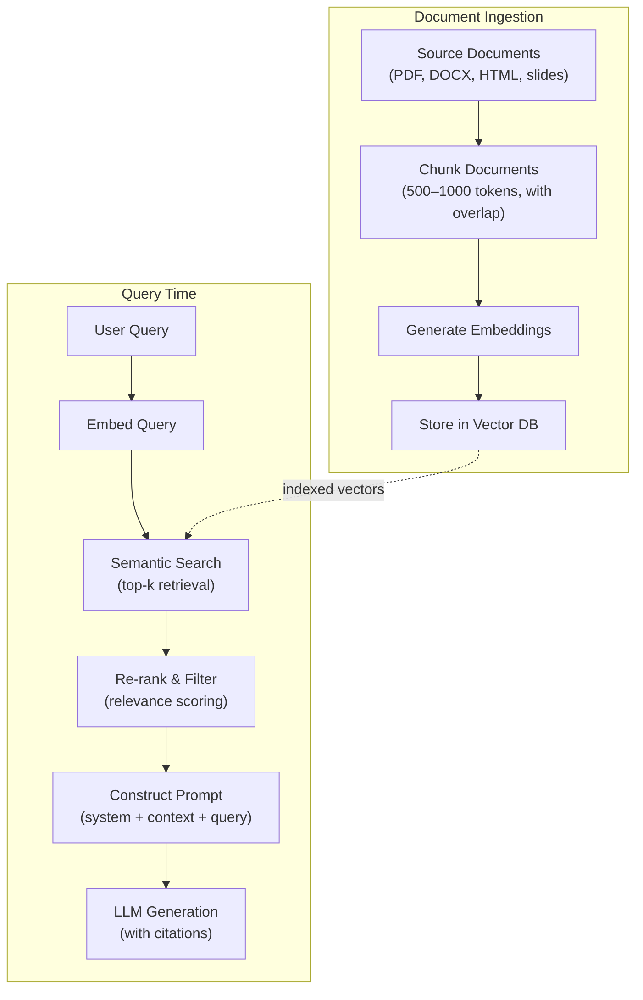
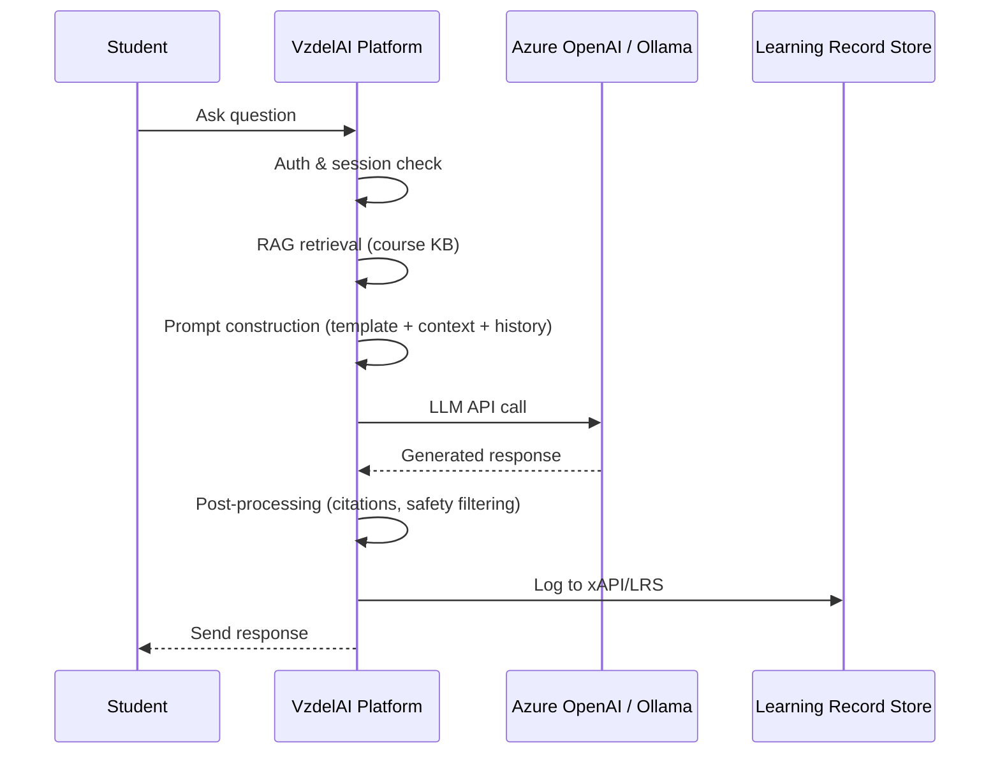
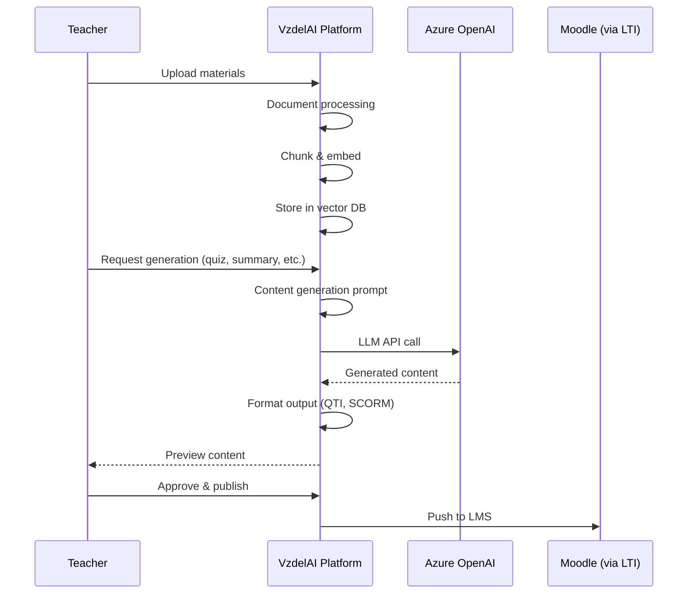

# 03 — Technical Architecture: Patterns & Components

> Reference architectures from research, common component patterns, and technology stack options for building an AI-powered educational platform.

---

## 1. Reference Architectures from Research

### 1.1 LPITutor Architecture (PeerJ Computer Science, 2025)

**Paper:** Alnawas, A., & Al-Araji, Z. (2025). LPITutor: AI-powered intelligent tutoring system using RAG and prompt engineering. *PeerJ Computer Science*, 11, e2289.
**DOI:** [10.7717/peerj-cs.2289](https://doi.org/10.7717/peerj-cs.2289)

#### Architecture Overview

LPITutor is a RAG-based intelligent tutoring system consisting of three core modules:



#### Key Design Decisions

| Decision | Choice | Rationale |
|----------|--------|-----------|
| LLM | GPT-3.5 via API | Cost-effective; no fine-tuning required due to RAG |
| Embedding | sentence-transformers | High-quality semantic embeddings for retrieval |
| Vector DB | ChromaDB | Lightweight, Python-native, open-source |
| Retrieval | Semantic similarity search | Top-k relevant chunks injected into prompt |
| Prompting | Dual-layer: static template + dynamic context | Ensures pedagogical consistency while adapting to queries |

#### Prompt Engineering Strategy

LPITutor uses a **dual-layer prompt system**:

1. **Static pedagogical template** — Defines the tutor's persona, subject domain, response style (Socratic, encouraging), and guardrails (stay on topic, don't reveal answers directly)
2. **Dynamic context injection** — RAG-retrieved document chunks are inserted into the prompt alongside the student's question

```
System Prompt (Static):
  "You are a knowledgeable tutor for [subject]. Guide students
   using the Socratic method. Use the provided context to answer
   accurately. If the context doesn't contain the answer, say so."

User Prompt (Dynamic):
  "Context: [RAG-retrieved chunks]
   Student Question: [user query]"
```

#### Performance Results

| Metric | LLM-Only | RAG-Enhanced | Improvement |
|--------|----------|-------------|-------------|
| Factual accuracy | 0.72 | **0.94** | +30.5% |
| User satisfaction | 3.8/5 | **4.6/5** | +21% |
| Hallucination rate | High | Minimal | Significant reduction |

**Key finding:** RAG boosted accuracy from 72% to **94%** — the single most impactful architectural decision.

---

### 1.2 Open TutorAI Architecture (arXiv, 2026)

**Paper:** Open TutorAI: An Open-Source AI-Native Platform for Immersive Tutoring Experiences. *arXiv preprint*, 2026.
**Source:** [arXiv](https://arxiv.org/)

#### Architecture Overview

Open TutorAI implements a **three-layer architecture** built on the OpenWebUI framework:



#### Four-Layer Prompting System

Open TutorAI extends LPITutor's dual-layer approach to **four layers**:

| Layer | Purpose | Persistence |
|-------|---------|-------------|
| **1. Global Context** | System role, platform rules, safety guardrails | Static per deployment |
| **2. Instructional Logic** | Pedagogical strategy (Socratic, scaffolding, direct instruction) | Per course/subject |
| **3. Adaptive Variables** | Student proficiency level, learning style, session history | Per student, dynamic |
| **4. Post-Interaction** | Reflection prompts, self-assessment triggers, session summaries | Per interaction |

#### Key Design Features

- **Dual LLM support:** Local (Ollama with LLaMA 3) AND cloud (GPT-4) — configurable per deployment
- **RAG with dual knowledge bases:** Curated institutional KB + user-uploaded documents
- **3D avatar-based interaction:** Immersive visual environment for increased engagement
- **Role-based access control (RBAC):** Four roles — learner, teacher, parent, admin
- **Docker/Kubernetes deployment:** Scalable container-based infrastructure
- **CUDA support:** GPU acceleration for local LLM inference

#### Deployment Configurations

| Configuration | LLM | Hardware | Use Case |
|--------------|-----|----------|----------|
| Cloud-only | GPT-4 API | Minimal server | Quick deployment, lower control |
| Local-only | Ollama/LLaMA 3 | GPU server (24GB+ VRAM) | Full data sovereignty |
| Hybrid | Both | GPU server + API keys | Best quality + privacy fallback |

---

### 1.3 Jill Watson Architecture (Georgia Tech)

**Source:** Goel, A., & Polepeddi, L. (2018). *Jill Watson: A Virtual Teaching Assistant for Online Education.* Georgia Institute of Technology. ([DiLab](https://dilab.gatech.edu/jill-watson/))

#### Architecture Overview

Jill Watson uses a **knowledge-based approach** combined with classification:



#### Key Insight

Jill Watson **outperforms general-purpose ChatGPT** in classroom settings because:
- Domain-specific training on course materials
- Confidence thresholding — only answers when certain
- Familiar with course-specific terminology, deadlines, and policies
- No hallucination about course logistics

---

## 2. Common Component Pattern

Synthesizing the architectures above, a **generalized component model** for AI educational platforms emerges:



### Layer Responsibilities

#### Frontend Layer
- **Chat interface:** Primary student interaction point; supports text, code, and rich media
- **Teacher dashboard:** Class overview, student progress, content management, alert management
- **Student dashboard:** Personal progress, learning path, assignment status
- **Content viewer:** Renders generated and curated learning materials
- **Admin panel:** System configuration, user management, model settings, analytics

#### Orchestration Layer
- **Prompt engine:** Multi-layer prompt construction following pedagogical principles
- **RAG pipeline:** Document ingestion → chunking → embedding → indexing → retrieval → ranking
- **Adaptive engine:** Student proficiency modeling, content difficulty adjustment, path optimization
- **Content generator:** Automated creation of lessons, quizzes, summaries, exercises
- **Assessment engine:** Rubric-based evaluation, AI-assisted grading, formative feedback
- **Analytics engine:** Learning event tracking (xAPI), progress visualization, predictive analytics

#### Backend Infrastructure
- **LLM APIs:** Cloud (OpenAI, Anthropic, Azure) and/or local (Ollama, vLLM) model access
- **Vector database:** Semantic search over course knowledge bases
- **LMS integration:** LTI for tool launch, SCORM for content packaging, xAPI for tracking
- **Auth & RBAC:** Single sign-on integration, role-based permissions (student, teacher, admin)
- **Student data store:** Profiles, interaction history, preferences, learning records
- **Learning records store (LRS):** xAPI-compliant event storage for analytics

---

## 3. Technology Stack Options

### LLM Providers

| Provider | Models | Hosting | Pros | Cons |
|----------|--------|---------|------|------|
| **OpenAI** | GPT-4, GPT-4o, GPT-5 | Cloud (API) | Best-in-class quality, wide adoption | Data leaves EU, cost per token |
| **Anthropic** | Claude 4.5, Claude Opus 4.6 | Cloud (API) | Strong safety features, long context | Data leaves EU, cost per token |
| **Azure OpenAI** | GPT-4, GPT-4o | Azure EU regions | EU data residency, enterprise SLAs | Higher per-token cost, Azure lock-in |
| **Ollama** | LLaMA 3, Mistral, Phi-3 | Self-hosted | Full data sovereignty, no API costs | Requires GPU hardware, lower quality |
| **vLLM** | Any HuggingFace model | Self-hosted | High throughput, OpenAI-compatible API | Complex setup, GPU requirements |

**Recommendation for VzdelAI:** Hybrid approach — Azure OpenAI for production quality with EU data residency; Ollama for development, testing, and privacy-sensitive workloads.

### Vector Databases

| Database | Type | Pros | Cons |
|----------|------|------|------|
| **pgvector** | PostgreSQL extension | Single DB for all data, familiar SQL, easy ops | Less optimized for very large collections |
| **Chroma** | Embedded / client-server | Simple Python API, open-source, lightweight | Limited scale |
| **Qdrant** | Dedicated vector DB | High performance, filtering, cloud + self-hosted | Additional infrastructure |
| **Weaviate** | Dedicated vector DB | GraphQL API, hybrid search, modules | Complexity |
| **Pinecone** | Managed cloud | Zero ops, fast, reliable | Cloud-only, data leaves EU |

**Recommendation for VzdelAI:** pgvector for initial deployment (simplicity, single database); Qdrant if scaling requires a dedicated vector store.

### Embedding Models

| Model | Dimensions | Quality | Speed | Cost |
|-------|-----------|---------|-------|------|
| **OpenAI text-embedding-3-large** | 3072 | Excellent | Fast (API) | $0.13/1M tokens |
| **OpenAI text-embedding-3-small** | 1536 | Good | Fast (API) | $0.02/1M tokens |
| **sentence-transformers/all-MiniLM-L6** | 384 | Good | Very fast (local) | Free |
| **BGE-large-en-v1.5** | 1024 | Excellent | Fast (local) | Free |
| **Multilingual-E5-large** | 1024 | Good (multilingual) | Fast (local) | Free |

**Recommendation for VzdelAI:** Multilingual-E5-large for local deployment (Slovak + English support); OpenAI text-embedding-3-small as cloud alternative.

### Backend Framework

| Framework | Language | Pros | Cons |
|-----------|----------|------|------|
| **FastAPI** | Python | Async, fast, great ML/AI ecosystem, type hints | Younger ecosystem |
| **Django** | Python | Batteries-included, ORM, admin panel | Synchronous by default |
| **LangChain / LangGraph** | Python | RAG pipeline abstraction, agent framework | Abstraction overhead, rapid API changes |
| **LlamaIndex** | Python | Purpose-built for RAG, document loaders | Narrower scope than LangChain |
| **Node.js (Express/Fastify)** | JavaScript | Fast I/O, same language as frontend | Weaker ML ecosystem |

**Recommendation for VzdelAI:** FastAPI as the core backend; LlamaIndex for RAG pipeline; LangGraph for complex agent workflows.

### Frontend Framework

| Framework | Pros | Cons |
|-----------|------|------|
| **Next.js (React)** | SSR/SSG, App Router, large ecosystem | Complex, React dependency |
| **OpenWebUI** | Ready-made chat UI, Ollama integration, plugin system | Less customizable for non-chat views |
| **Streamlit** | Rapid prototyping, Python-native | Not production-grade, limited customization |
| **SvelteKit** | Fast, lightweight, simple | Smaller ecosystem |

**Recommendation for VzdelAI:** Next.js for the main platform; OpenWebUI components as reference for chat interface patterns.

### Learning Standards

| Standard | Purpose | Integration Point |
|----------|---------|-------------------|
| **LTI 1.3** (Learning Tools Interoperability) | Tool launch from LMS | Moodle ↔ VzdelAI integration |
| **xAPI** (Experience API) | Learning event tracking | Analytics and learning records |
| **SCORM 2004** | Content packaging | Importable course content |
| **QTI** (Question & Test Interoperability) | Assessment interchange | Quiz/test portability |

**Recommendation for VzdelAI:** LTI 1.3 for LMS integration (critical); xAPI for analytics (critical); SCORM for content import (nice-to-have).

### Deployment & Infrastructure

| Component | Options | Recommendation |
|-----------|---------|----------------|
| **Containerization** | Docker, Podman | Docker (standard, wide support) |
| **Orchestration** | Kubernetes, Docker Compose | Docker Compose (initial); K8s (scale) |
| **CI/CD** | GitHub Actions, GitLab CI | Depends on university infrastructure |
| **Monitoring** | Prometheus + Grafana, Datadog | Prometheus + Grafana (open-source) |
| **Logging** | ELK Stack, Loki | Loki + Grafana (lightweight) |
| **Cache** | Redis, Memcached | Redis (versatile, pub/sub support) |
| **Message Queue** | RabbitMQ, Redis Streams | Redis Streams (simplify stack) |

---

## 4. RAG Pipeline Design

The RAG (Retrieval-Augmented Generation) pipeline is the **most critical technical component**, as demonstrated by LPITutor's 72% → 94% accuracy improvement.

### Pipeline Stages



### Chunking Strategy

| Strategy | Chunk Size | Overlap | Best For |
|----------|-----------|---------|----------|
| Fixed-size | 500–1000 tokens | 100–200 tokens | General documents |
| Sentence-based | Variable | Sentence boundary | Textbooks, papers |
| Semantic | Variable | Natural topic breaks | Lecture notes, slides |
| Hierarchical | Parent + child chunks | Parent for context, child for precision | Complex documents |

**Recommendation:** Start with fixed-size (512 tokens, 128 overlap) using recursive text splitting; move to semantic chunking as content types diversify.

### Retrieval Enhancement

| Technique | Description | Impact |
|-----------|-------------|--------|
| **Hybrid search** | Combine dense (semantic) + sparse (BM25) retrieval | Better recall for technical terms |
| **Re-ranking** | Cross-encoder model re-ranks initial results | Higher precision in top-k |
| **Query expansion** | Rephrase/expand user query before retrieval | Better recall for vague queries |
| **Metadata filtering** | Filter by course, topic, document type | Faster, more relevant results |
| **Multi-query** | Generate multiple query variants | More robust retrieval |

---

## 5. Data Flow Architecture

### Student Interaction Flow



### Teacher Content Generation Flow



---

## References

- Alnawas, A., & Al-Araji, Z. (2025). LPITutor: AI-powered intelligent tutoring system using RAG and prompt engineering. *PeerJ Computer Science*, 11, e2289. https://doi.org/10.7717/peerj-cs.2289
- Open TutorAI. (2026). An Open-Source AI-Native Platform for Immersive Tutoring Experiences. *arXiv preprint*. https://arxiv.org/
- Goel, A., & Polepeddi, L. (2018). Jill Watson: A Virtual Teaching Assistant for Online Education. Georgia Institute of Technology. https://dilab.gatech.edu/jill-watson/
- LangChain. (2025). *RAG Documentation*. https://python.langchain.com/docs/tutorials/rag/
- LlamaIndex. (2025). *Building RAG Applications*. https://docs.llamaindex.ai/
- OpenWebUI. (2025). *Open-Source AI Interface*. https://openwebui.com/
- IMS Global. (2025). *LTI 1.3 Specification*. https://www.imsglobal.org/activity/learning-tools-interoperability
- ADL Initiative. (2025). *xAPI Specification*. https://xapi.com/
