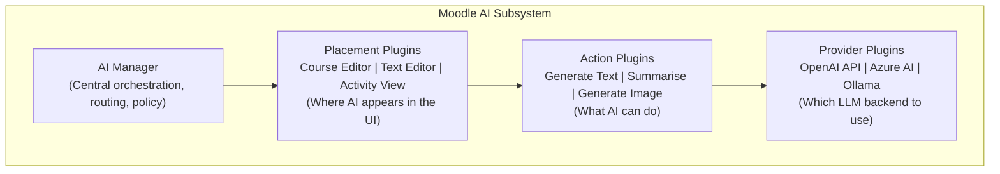
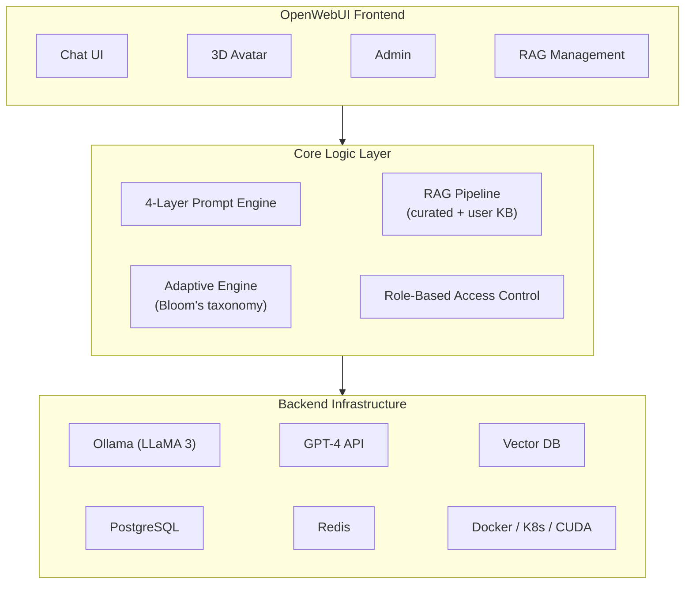
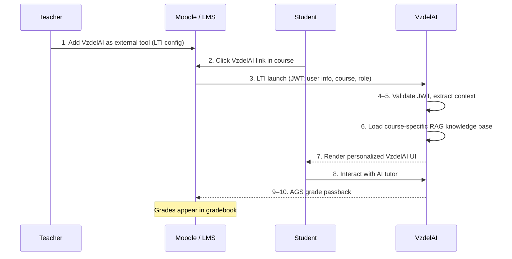

# 05 — Open-Source Tools: Moodle AI, Open edX, and Open-Source Platforms

> Analysis of open-source platforms and LMS integration options relevant to VzdelAI development.

---

## 1. Moodle AI (v4.5+)

### Overview

Moodle 4.5 (released 2025) introduced a **built-in AI subsystem** that transforms the platform from a traditional LMS to an AI-enhanced learning environment. This is the most significant Moodle development for VzdelAI integration.

**Source:** [Moodle AI Documentation](https://moodledev.io/docs/apis/subsystems/ai)

### Architecture



### Plugin Architecture

Moodle's AI subsystem uses a **three-layer plugin architecture**:

| Layer | Purpose | Examples |
|-------|---------|---------|
| **Placement** | Defines WHERE AI features appear in the Moodle UI | Course editor, text editor, activity page |
| **Action** | Defines WHAT the AI can do | Generate text, summarize, generate images |
| **Provider** | Defines WHICH LLM backend processes requests | OpenAI API, Azure AI, Ollama (local) |

This separation means VzdelAI could implement a **custom provider plugin** that routes Moodle's AI requests to VzdelAI's own RAG-enhanced backend.

### Supported Provider Plugins

| Provider | Type | Notes |
|----------|------|-------|
| **OpenAI API** | Cloud | Direct integration with GPT-4/5 |
| **Azure AI** | Cloud | Azure-hosted OpenAI models, EU data residency |
| **Ollama** | Local | Self-hosted LLMs (LLaMA 3, Mistral, etc.) |

### Community AI Plugins

Beyond the built-in subsystem, the Moodle community has developed several AI plugins:

| Plugin | Description | Status |
|--------|-------------|--------|
| **AI Connector (block_aic)** | General-purpose AI chat block for Moodle pages | Active, community-maintained |
| **AI Questions Generator** | Generates quiz questions from course content | Active |
| **OpenAI Chat Block** | ChatGPT-style chat within Moodle courses | Active |
| **AI Text to Questions** | Converts text passages into quiz questions | Active |
| **Content Generator** | AI-generated course content from prompts | Active |

**Source:** [Moodle Plugins Directory — AI](https://moodle.org/plugins/)

### Configurable Model Selection

A key feature of Moodle 4.5's AI subsystem is **per-task model configuration**:

| Task | Recommended Model | Rationale |
|------|-------------------|-----------|
| Text summarization | Smaller/faster model (GPT-3.5, LLaMA 3 8B) | Simple task, cost efficiency |
| Content generation | Larger/capable model (GPT-4, LLaMA 3 70B) | Quality matters for educational content |
| Image generation | DALL-E 3, Stable Diffusion | Specialized image models |
| Question generation | Medium model with domain context | Balance of quality and cost |

### VzdelAI Integration Strategy with Moodle

**Option A: Custom Provider Plugin**
- Build a Moodle AI provider plugin that routes requests to VzdelAI's backend
- VzdelAI adds RAG context and pedagogical prompts before forwarding to LLM
- Seamless integration — teachers use familiar Moodle interface

**Option B: LTI Integration**
- VzdelAI deployed as an LTI 1.3 tool
- Launched from within Moodle courses as an external tool
- Own interface, but accessible from course navigation

**Option C: Both**
- Provider plugin for in-Moodle AI features (text generation, summarization)
- LTI tool for full VzdelAI experience (chat, dashboard, analytics)

**Recommendation:** Option C — provides both seamless integration and full-featured access.

---

## 2. Open edX

### Overview

Open edX is an open-source learning platform originally developed by MIT and Harvard, now maintained by the Open edX community and Axim Collaborative.

**Source:** [Open edX](https://openedx.org/)

### Key Features (2025)

| Feature | Description |
|---------|-------------|
| **LTI Advantage Complete** | Certified LTI 1.3 support (2025), enabling external tool integration |
| **XBlock Architecture** | Plugin system for custom course components |
| **Open API** | RESTful APIs for integration |
| **Mobile Support** | iOS and Android native apps |
| **Analytics** | Insights dashboard for instructors |
| **Multi-tenancy** | Single deployment serving multiple organizations |

### AI Integrations

| Integration | Description | Source |
|-------------|-------------|--------|
| **LearnWise AI** | AI-powered student support chatbot for Open edX | [LearnWise](https://learnwise.ai/) |
| **Custom XBlocks** | Community-developed AI-powered course components | Open edX Marketplace |
| **LTI Tools** | Any LTI-compatible AI tool can be embedded | LTI 1.3 standard |

### Relevance to VzdelAI

- **LTI 1.3 integration** is the standard path — VzdelAI as an LTI tool works with both Moodle and Open edX
- **XBlock architecture** could be used if University of Žilina uses Open edX
- **LearnWise AI** provides a reference implementation for AI chat in LMS context
- **Lower priority** than Moodle for VzdelAI unless the university uses Open edX

---

## 3. Open TutorAI

### Overview

Open TutorAI is a **fully open-source AI tutoring platform** built on the OpenWebUI framework, designed for immersive educational experiences.

**Source:** arXiv preprint (2026); [OpenWebUI](https://openwebui.com/)

### Architecture



### Key Features

| Feature | Description | Relevance to VzdelAI |
|---------|-------------|----------------------|
| **Dual LLM support** | Local (Ollama) + cloud (GPT-4) | Hybrid strategy model |
| **4-layer prompting** | Global → Instructional → Adaptive → Post-interaction | Advanced prompt architecture reference |
| **Dual knowledge bases** | Curated institutional + user-uploaded | RAG design pattern |
| **3D avatar** | Immersive visual interaction | Future enhancement possibility |
| **RBAC** | Learner, teacher, parent, admin roles | Role model reference |
| **Docker/K8s** | Container-based deployment | Standard deployment pattern |
| **CUDA support** | GPU acceleration for local LLMs | Local deployment capability |

### Deployment with Docker

```yaml
# Simplified Docker Compose for Open TutorAI
services:
  ollama:
    image: ollama/ollama
    volumes:
      - ollama_data:/root/.ollama
    deploy:
      resources:
        reservations:
          devices:
            - capabilities: [gpu]

  open-webui:
    image: ghcr.io/open-webui/open-webui
    ports:
      - "3000:8080"
    environment:
      - OLLAMA_BASE_URL=http://ollama:11434
    volumes:
      - webui_data:/app/backend/data
    depends_on:
      - ollama
```

### Lessons for VzdelAI

1. **OpenWebUI as a foundation** — mature, well-tested chat interface that can be customized
2. **Prompt layering** — the 4-layer approach is more sophisticated than simple system prompts
3. **Dual knowledge base** — allows both institutional control and teacher flexibility
4. **Role-based access** — essential for educational context (different views for students vs. teachers)

---

## 4. Other Open-Source Tools & Libraries

### 4.1 H5P — Interactive Content Creation

| Aspect | Details |
|--------|---------|
| **What** | Open-source framework for creating interactive educational content |
| **Content types** | Interactive video, course presentations, quizzes, drag-and-drop, flashcards, and 50+ more |
| **Integration** | Moodle plugin, WordPress plugin, Drupal, LTI |
| **AI potential** | AI-generated H5P content could automate interactive material creation |
| **Source** | [H5P](https://h5p.org/) |

### 4.2 AI-Tutor (GitHub)

| Aspect | Details |
|--------|---------|
| **What** | Open-source LLM + RAG tutoring system for various courses |
| **Architecture** | Python backend, RAG pipeline, support for multiple LLMs |
| **Features** | Course-specific knowledge bases, conversational tutoring |
| **Relevance** | Reference implementation for RAG-based educational chat |
| **Source** | [GitHub — AI-Tutor](https://github.com/) |

### 4.3 LangChain / LlamaIndex

| Library | Focus | Key Feature for VzdelAI |
|---------|-------|------------------------|
| **LangChain** | General LLM application framework | Agent workflows, chains, memory management |
| **LlamaIndex** | Data indexing and retrieval | Document loaders, vector store abstractions, RAG pipelines |
| **LangGraph** | Agent orchestration | Stateful multi-agent workflows, tool use |

### 4.4 Ollama

| Aspect | Details |
|--------|---------|
| **What** | Tool for running LLMs locally with simple API |
| **Models** | LLaMA 3, Mistral, Phi-3, Gemma, CodeLlama, and more |
| **API** | OpenAI-compatible REST API |
| **Integration** | Works with Moodle AI, OpenWebUI, LangChain, LlamaIndex |
| **Relevance** | Enables local LLM deployment for data-sovereign operations |
| **Source** | [Ollama](https://ollama.com/) |

### 4.5 Compatible Local LLM Serving Solutions

| Tool | Description | Use Case |
|------|-------------|----------|
| **Ollama** | Simple local LLM runner | Development, small-scale deployment |
| **LiteLLM** | Unified API proxy for 100+ LLM providers | Abstraction layer across providers |
| **LocalAI** | OpenAI-compatible local inference | Production local deployment |
| **vLLM** | High-throughput LLM serving | Production-scale local deployment |
| **Groq** | Cloud inference with dedicated hardware | Ultra-fast inference (cloud) |

---

## 5. LMS Integration Standards

### LTI 1.3 (Learning Tools Interoperability)

**The primary standard for integrating VzdelAI with any LMS.**

| Aspect | Details |
|--------|---------|
| **Purpose** | Standardized tool launch from LMS to external tool |
| **Authentication** | OAuth 2.0 based security model |
| **Data exchange** | Student identity, course context, roles, grades |
| **Grade passback** | Assignment Grades Service (AGS) for returning scores |
| **Deep linking** | Content-Item Message for creating links in courses |
| **Compatibility** | Moodle, Open edX, Canvas, Blackboard, Brightspace, and more |
| **Specification** | [IMS Global — LTI 1.3](https://www.imsglobal.org/activity/learning-tools-interoperability) |

#### LTI Integration Flow for VzdelAI



### xAPI (Experience API)

**For learning analytics and event tracking.**

| Aspect | Details |
|--------|---------|
| **Purpose** | Track and record learning experiences across systems |
| **Format** | Actor-Verb-Object statements (e.g., "Student answered question correctly") |
| **Storage** | Learning Record Store (LRS) |
| **Compatibility** | Platform-agnostic — works across LMS, apps, simulations |
| **Specification** | [xAPI](https://xapi.com/) |

#### Example xAPI Statements for VzdelAI

```json
{
  "actor": {
    "account": { "name": "student123", "homePage": "https://vzdelai.uniza.sk" }
  },
  "verb": {
    "id": "http://adlnet.gov/expapi/verbs/asked",
    "display": { "en-US": "asked" }
  },
  "object": {
    "id": "https://vzdelai.uniza.sk/courses/economics/topic/gdp",
    "definition": {
      "name": { "en-US": "Question about GDP calculation" },
      "type": "http://adlnet.gov/expapi/activities/question"
    }
  },
  "result": {
    "response": "How is GDP calculated using the expenditure approach?",
    "extensions": {
      "https://vzdelai.uniza.sk/xapi/rag-sources": 3,
      "https://vzdelai.uniza.sk/xapi/confidence-score": 0.92
    }
  },
  "timestamp": "2026-03-15T10:30:00Z"
}
```

### SCORM 2004

| Aspect | Details |
|--------|---------|
| **Purpose** | Packaging and delivering learning content |
| **Use case** | Import/export course content between systems |
| **Relevance** | VzdelAI-generated content could be exported as SCORM packages for LMS import |
| **Priority** | Lower than LTI and xAPI for VzdelAI |

---

## 6. Comparison: Open-Source Options for VzdelAI

| Feature | Moodle AI | Open TutorAI | OpenWebUI | Custom Build |
|---------|-----------|-------------|-----------|-------------|
| **Ready-to-use** | ✅ (with Moodle) | ✅ | ✅ | ❌ |
| **RAG support** | Limited | ✅ | ✅ | ✅ |
| **LMS integration** | Native | ❌ | ❌ | Via LTI |
| **Customization** | Plugin-based | High | High | Full |
| **Multi-role** | ✅ | ✅ | Basic | ✅ |
| **Local LLM** | ✅ (Ollama) | ✅ | ✅ | ✅ |
| **Learning analytics** | Basic | Limited | ❌ | ✅ (xAPI) |
| **Pedagogical design** | Basic | Advanced | None | ✅ |
| **Deployment** | LAMP/Docker | Docker/K8s | Docker | Docker/K8s |
| **Maintenance burden** | Low | Medium | Low | High |

**Recommendation for VzdelAI:** Custom build using OpenWebUI/Open TutorAI patterns for the AI core, with LTI integration for Moodle connectivity and Bot Framework for Teams delivery.

---

## References

- Moodle. (2025). *AI Subsystem Documentation*. https://moodledev.io/docs/apis/subsystems/ai
- Moodle. (2025). *Moodle 4.5 Release Notes*. https://moodle.com/news/
- Moodle. (2025). *Moodle Plugins Directory — AI Category*. https://moodle.org/plugins/
- Open edX. (2025). *Platform Documentation*. https://openedx.org/
- OpenWebUI. (2025). *Open-Source AI Interface*. https://openwebui.com/
- Ollama. (2025). *Local LLM Runner*. https://ollama.com/
- H5P. (2025). *Interactive Content Framework*. https://h5p.org/
- IMS Global. (2025). *LTI 1.3 and LTI Advantage*. https://www.imsglobal.org/activity/learning-tools-interoperability
- ADL Initiative. (2025). *Experience API (xAPI) Specification*. https://xapi.com/
- LangChain. (2025). *Documentation*. https://python.langchain.com/
- LlamaIndex. (2025). *Documentation*. https://docs.llamaindex.ai/
