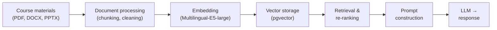
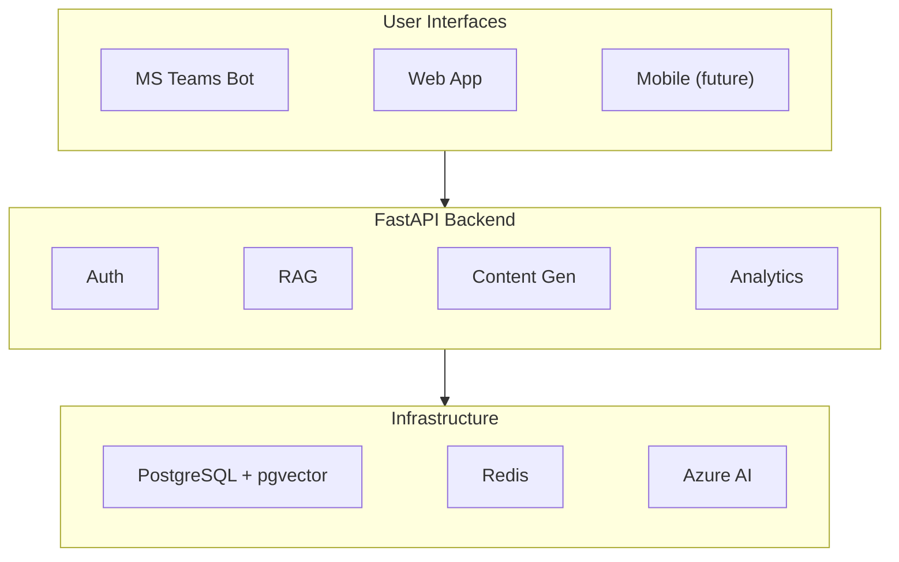
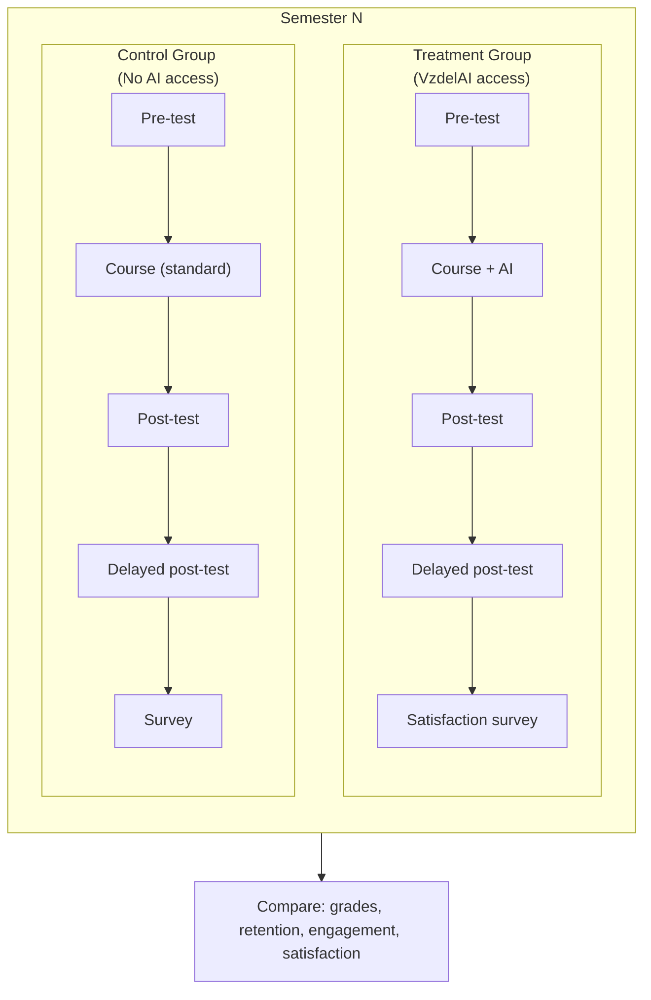
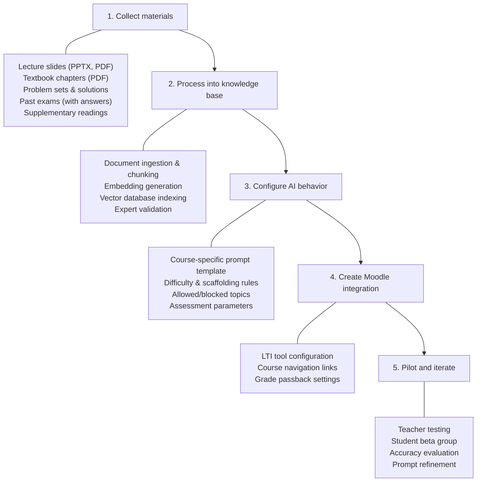
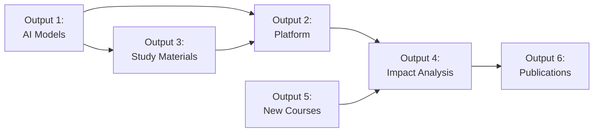

# Component Mapping: VzdelAI Project Outputs → Platform Components

> Maps each VzdelAI project output to the specific platform components, technologies, and research-backed approaches needed for implementation.

---

## Overview

The VzdelAI project is expected to deliver six major outputs. This document maps each output to the platform components, technologies, data flows, and relevant research findings that support implementation.

---

## Output 1: AI Models Adapted for Education

### Description
Fine-tuned and/or RAG-enhanced LLMs specifically adapted for educational use in Economics and Finance domains at University of Žilina.

### Component Mapping

| Component | Technology | Purpose |
|-----------|-----------|---------|
| **RAG Pipeline** | LlamaIndex + pgvector | Ground LLM responses in course-specific materials |
| **Course Knowledge Bases** | Vector embeddings (Multilingual-E5-large) | Searchable corpus of lecture notes, textbooks, papers |
| **Prompt Engineering System** | 4-layer prompting (Open TutorAI pattern) | Pedagogical guardrails, Socratic method, adaptive difficulty |
| **LLM Backend** | Azure OpenAI GPT-4o (production) + Ollama/LLaMA 3 (local) | Language understanding and generation |
| **Evaluation Framework** | Custom benchmark suite | Measure accuracy, pedagogical quality, hallucination rate |

### Key Research Findings

| Finding | Source | Implication |
|---------|--------|-------------|
| RAG boosts accuracy 72% → 94% | LPITutor (PeerJ, 2025) | RAG is essential — eliminates need for fine-tuning |
| Domain-specific systems outperform generic LLMs | Jill Watson (Georgia Tech) | Course-specific knowledge bases are critical |
| 4-layer prompting improves pedagogical quality | Open TutorAI (arXiv, 2026) | Multi-layer prompt architecture recommended |

### Data Flow

### Deliverables
- [ ] RAG pipeline for Economics course materials
- [ ] RAG pipeline for Finance course materials
- [ ] Prompt engineering templates (Socratic, explanatory, assessment)
- [ ] Evaluation benchmark per course (100+ Q&A pairs)
- [ ] Accuracy report: RAG vs. LLM-only comparison

---

## Output 2: VzdelAI Interactive Platform

### Description
Web-based and Teams-integrated platform providing AI tutoring, teacher tools, dashboards, and administrative features.

### Component Mapping

| Component | Technology | Purpose |
|-----------|-----------|---------|
| **Web Application** | Next.js (React) | Dashboard, analytics, content management, admin |
| **Chat Interface** | React + WebSocket | Real-time AI tutoring conversations |
| **MS Teams Bot** | Azure Bot Framework (Python) | Primary student interface within Teams |
| **Adaptive Cards** | Teams SDK | Rich interactive content (quizzes, feedback) in Teams |
| **Teacher Dashboard** | Next.js + Chart.js/Recharts | Class overview, student progress, AI content management |
| **Student Dashboard** | Next.js | Personal progress, learning path, study recommendations |
| **Admin Panel** | Next.js | User management, model configuration, compliance tools |
| **API Backend** | FastAPI (Python) | REST/WebSocket API serving all frontends |
| **Authentication** | Entra ID (Azure AD) SSO | University account integration |
| **Authorization** | RBAC (student, teacher, admin) | Role-based feature access |

### Architecture

### Deliverables
- [ ] FastAPI backend with RAG integration
- [ ] MS Teams bot (personal + channel)
- [ ] Web application (Next.js) with dashboards
- [ ] Entra ID SSO integration
- [ ] RBAC system (student, teacher, admin roles)
- [ ] Adaptive Cards for Teams interactions

---

## Output 3: Personalized Study Materials

### Description
AI-generated personalized study materials including summaries, quizzes, practice problems, flashcards, and study guides tailored to individual student needs.

### Component Mapping

| Component | Technology | Purpose |
|-----------|-----------|---------|
| **Content Generation Pipeline** | LLM + RAG + templates | Generate materials from course knowledge base |
| **Quiz Generator** | LLM + QTI format | Create formative assessment questions |
| **Summary Generator** | LLM + RAG retrieval | Summarize lectures, chapters, papers |
| **Flashcard Generator** | LLM + structured output | Key term/concept flashcard generation |
| **Template Engine** | Jinja2 / custom | Consistent formatting across content types |
| **H5P Integration** | H5P library | Interactive content packaging |
| **Teacher Review Workflow** | Custom UI | Human review before student access |
| **Personalization Engine** | Student model + adaptive logic | Adapt difficulty and style to student level |

### Content Types

| Type | Generation Method | Output Format | Teacher Review |
|------|-------------------|---------------|----------------|
| **Quiz questions** | LLM generates from RAG context | QTI / Moodle XML / Adaptive Card | Required |
| **Topic summaries** | LLM summarizes retrieved documents | Markdown / PDF | Recommended |
| **Practice problems** | LLM generates with scaffolded hints | Interactive (H5P) / Adaptive Card | Required |
| **Flashcards** | LLM extracts key terms and definitions | Structured JSON / Anki export | Optional |
| **Study guides** | LLM organizes topics with explanations | Markdown / PDF | Recommended |
| **Presentations** | LLM generates outline + content | PPTX (via python-pptx) | Required |

### Personalization Dimensions

| Dimension | Data Source | Adaptation |
|-----------|------------|------------|
| **Knowledge level** | Quiz scores, interaction history | Adjust difficulty of generated materials |
| **Learning pace** | Session duration, question frequency | Adjust content volume and depth |
| **Topic gaps** | Incorrect answers, repeated questions | Focus materials on weak areas |
| **Language preference** | User profile | Generate in Slovak or English |

### Deliverables
- [ ] Quiz generation pipeline (with teacher review workflow)
- [ ] Summary generation pipeline
- [ ] Flashcard generation pipeline
- [ ] Student proficiency model (based on xAPI data)
- [ ] Personalization rules engine
- [ ] H5P content export for Moodle

---

## Output 4: Impact Analysis

### Description
Comprehensive analysis of VzdelAI's impact on learning outcomes, teaching efficiency, student engagement, and platform effectiveness.

### Component Mapping

| Component | Technology | Purpose |
|-----------|-----------|---------|
| **xAPI Event Tracking** | xAPI standard + custom LRS | Capture all learning events |
| **Learning Record Store** | PostgreSQL (custom tables) | Store and query xAPI statements |
| **Analytics Engine** | Python (pandas, scipy) | Statistical analysis of learning data |
| **Reporting Dashboard** | Next.js + Recharts | Visual analytics for stakeholders |
| **A/B Testing Framework** | Custom (treatment/control groups) | Compare AI vs. non-AI learning outcomes |
| **Export Pipeline** | CSV, JSON, SPSS format | Data export for external statistical analysis |
| **Research Ethics Integration** | Consent management | Ethics board compliance for research use |

### Metrics Framework

| Category | Metric | Measurement Method |
|----------|--------|-------------------|
| **Learning Outcomes** | Grade comparison (AI vs. control) | Pre/post test scores, course grades |
| **Learning Outcomes** | Knowledge retention | Delayed post-test (2–4 weeks after instruction) |
| **Student Engagement** | Session frequency and duration | xAPI event tracking |
| **Student Engagement** | Questions asked per session | xAPI event counting |
| **Student Satisfaction** | User satisfaction score | Periodic surveys (Likert scale) |
| **Teacher Efficiency** | Time saved on tasks | Teacher self-reported surveys |
| **Teacher Efficiency** | Content generation throughput | System metrics (items created/hour) |
| **AI Quality** | RAG accuracy (factual correctness) | Expert evaluation of AI responses |
| **AI Quality** | Pedagogical quality | Expert rubric evaluation |
| **AI Quality** | Hallucination rate | Automated + manual checking |
| **Platform** | System uptime and response time | Infrastructure monitoring |
| **Platform** | User adoption rate | Active users / enrolled users |

### Study Design

### Deliverables
- [ ] xAPI tracking implementation across all interactions
- [ ] Analytics dashboard for teachers and administrators
- [ ] A/B testing framework (treatment vs. control groups)
- [ ] Semester-end impact report template
- [ ] Data export for external statistical analysis (SPSS, R)
- [ ] Research ethics protocol and consent forms

---

## Output 5: New Courses (Economics, Finance)

### Description
AI-enhanced courses in Economics and Finance domains, utilizing VzdelAI platform for personalized instruction.

### Component Mapping

| Component | Technology | Purpose |
|-----------|-----------|---------|
| **Course Knowledge Bases** | Domain-specific RAG corpora | Ground AI in Economics/Finance materials |
| **Subject-Specific RAG** | Curated document collections per course | Accurate, course-aligned AI responses |
| **Curriculum Mapping** | Structured metadata | Map knowledge base content to learning objectives |
| **Assessment Integration** | Quiz generator + Moodle LTI | AI-generated formative assessments within LMS |
| **Moodle Course Structure** | SCORM/LTI packages | Course content delivered through Moodle |
| **VzdelAI Course Configuration** | Admin panel settings | Per-course RAG settings, prompt templates, access rules |

### Course Setup Workflow

### Economics-Specific Considerations

| Aspect | Implementation |
|--------|---------------|
| **Mathematical content** | LaTeX rendering in AI responses; step-by-step problem solving |
| **Graph/chart understanding** | Multimodal LLM support for interpreting economic graphs |
| **Current events** | Periodic knowledge base updates with recent economic data |
| **Multiple perspectives** | Prompt engineering to present different economic schools of thought |

### Finance-Specific Considerations

| Aspect | Implementation |
|--------|---------------|
| **Numerical precision** | Validated calculation pipelines; no LLM-generated arithmetic |
| **Financial regulations** | Knowledge base includes relevant EU/Slovak financial regulations |
| **Case studies** | RAG corpus includes real-world financial case studies |
| **Formulas** | LaTeX rendering; formula lookup from knowledge base (not generated) |

### Deliverables
- [ ] Economics course knowledge base (RAG-indexed)
- [ ] Finance course knowledge base (RAG-indexed)
- [ ] Course-specific prompt templates
- [ ] Moodle LTI integration per course
- [ ] AI-generated quiz banks per course
- [ ] Pilot evaluation report per course

---

## Output 6: Publications

### Description
Academic publications documenting VzdelAI's architecture, methodology, and impact findings.

### Component Mapping

| Component | Technology | Purpose |
|-----------|-----------|---------|
| **Analytics Data Export** | Python data pipeline | Extract anonymized data for statistical analysis |
| **Experiment Logging** | MLflow / custom logging | Track model versions, prompt changes, accuracy metrics |
| **Anonymization Pipeline** | Custom (k-anonymity, differential privacy) | GDPR-compliant data for publication |
| **Benchmark Suite** | Custom evaluation scripts | Reproducible accuracy/quality measurements |
| **Visualization Tools** | Matplotlib, Seaborn, Plotly | Publication-quality charts and figures |

### Target Publications

| Venue | Type | Topic | Timeline |
|-------|------|-------|----------|
| *PeerJ Computer Science* | Journal | VzdelAI architecture + RAG evaluation | After Phase 2 |
| *Computers & Education* | Journal | Impact on learning outcomes | After Phase 3 |
| *AIED Conference* | Conference | Socratic AI tutoring methodology | Annual submission |
| *ECTEL Conference* | Conference | EU-compliant educational AI design | Annual submission |
| *LAK Conference* | Conference | Learning analytics from VzdelAI | Annual submission |
| Slovak national venue | Conference | AI in Slovak higher education context | After Phase 1 |

### Publication Data Requirements

| Publication Type | Data Needed | Privacy Measures |
|-----------------|-------------|-----------------|
| Architecture paper | System design, component benchmarks | No student data |
| Impact study | Pre/post test scores, engagement metrics | Anonymized, aggregated |
| Case study | Qualitative student/teacher feedback | Pseudonymized quotes |
| Technical evaluation | RAG accuracy, response quality scores | No student data |

### Deliverables
- [ ] Experiment tracking infrastructure (MLflow or custom)
- [ ] Anonymization pipeline for research data
- [ ] Publication-ready evaluation methodology
- [ ] Benchmark suite with reproducible results
- [ ] At least 2 publications submitted within project period

---

## Cross-Output Dependencies

| Dependency | Description |
|------------|-------------|
| Output 1 → Output 2 | AI models must be developed before platform can function |
| Output 1 → Output 3 | RAG pipeline powers personalized material generation |
| Output 2 → Output 4 | Platform must be operational to collect impact data |
| Output 2 → Output 5 | Platform infrastructure needed for course delivery |
| Output 5 → Output 4 | Courses must be running to measure impact |
| Output 4 → Output 6 | Impact data needed for publications |

---

## Timeline Summary

| Month | Output 1 | Output 2 | Output 3 | Output 4 | Output 5 | Output 6 |
|-------|----------|----------|----------|----------|----------|----------|
| 1–2 | RAG pipeline dev | Backend setup | — | — | Material collection | — |
| 3–4 | Prompt engineering | Teams bot + web app | Quiz generator | Tracking setup | KB building | — |
| 5–6 | Model evaluation | Dashboard + LTI | Summary + flashcards | Analytics dashboard | Course config | — |
| 7–9 | Optimization | Scale + refine | Personalization | Data collection | Pilot courses | Architecture paper |
| 10–12 | Monitoring | University-wide | Full pipeline | Analysis | Full deployment | Impact paper |
| 13–18 | Maintenance | Maintenance | Iteration | Longitudinal | Iteration | Publication |
