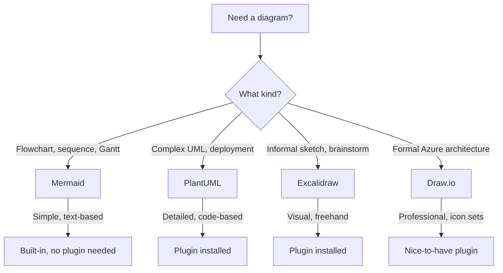

# Recommended Obsidian Plugins

> [!note]
> Recommendations for the VzdelAI research vault. Prioritized for the current research & planning phase.

## Currently Installed

| Plugin | Type | Category | Why | Status |
|--------|------|----------|-----|--------|
| Mermaid | Built-in | Diagrams | Flowcharts, sequence diagrams, Gantt charts — text-based, no plugin needed | Available |
| Bases (datatables) | Core | Data | Structured data views and tables within the vault | Enabled |
| PlantUML | Community | Diagrams | Complex UML, deployment diagrams, detailed component relationships | Installed |
| Dataview | Community | Data querying | Dynamic tables, document indexes, metadata queries across vault | Installed |
| Zotero Integration | Community | Literature | Import citations, PDF annotations from Zotero; critical for Activity 6 (publishing) | Installed |
| Linter | Community | Writing | Enforces consistent formatting, frontmatter structure across all docs | Installed |
| Advanced Tables | Community | Writing | Spreadsheet-like table editing; many research docs are table-heavy | Installed |
| Tag Wrangler | Community | Navigation | Rename, merge, reorganize tags as taxonomy evolves | Installed |
| Enhancing Export | Community | Export | Pandoc-based export to DOCX, LaTeX, PDF for deliverables and papers | Installed |
| Excalidraw | Community | Diagrams | Informal sketches, architecture brainstorming, visual planning | Installed |
| Templater | Community | Productivity | Advanced templates with variables for standardized research docs | Installed |
| QuickAdd | Community | Productivity | One-click workflows: "New Research Doc", "Add Literature Note" | Installed |
| Omnisearch | Community | Search | Relevance-ranked full-text search, PDF indexing | Installed |

## Nice-to-Have — Install as Needed

| Plugin | Category | Plugin ID | Why |
|--------|----------|-----------|-----|
| Reference Map | Literature | `reference-map` | Citation network exploration via Semantic Scholar |
| Footnote Shortcut | Writing | `obsidian-footnotes` | Keyboard shortcuts for academic footnotes |
| Folder Notes | Navigation | `folder-notes` | Index notes for folders (Notion-style) |
| Breadcrumbs | Navigation | `breadcrumbs` | Explicit hierarchical links between research docs |
| Better Export PDF | Export | `better-export-pdf` | Enhanced PDF export with TOC, bookmarks, batch export |
| Draw.io | Diagrams | `drawio-obsidian` | Formal diagrams with Azure architecture icon sets |
| Kanban | Productivity | `obsidian-kanban` | Visual task tracking boards (markdown-backed) |
| Tasks | Productivity | `obsidian-tasks-plugin` | Enhanced task management with due dates, queries |
| Smart Connections | AI/Search | `smart-connections` | Local AI embeddings for semantic similarity between notes |

## Also Recommended

- **Enable core `footnotes` plugin** (currently disabled) — adds built-in footnotes sidebar view

## Diagram Tool Selection Guide

