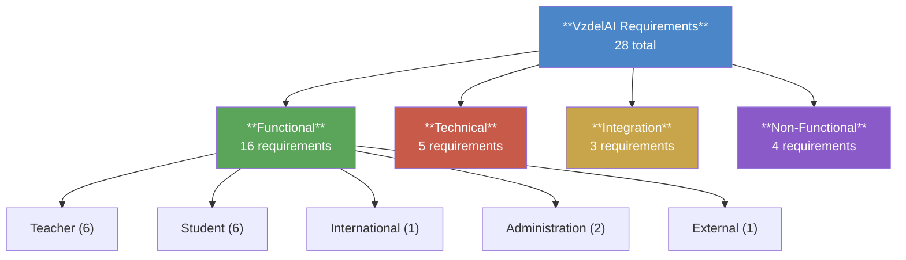

# Requirements Index

> [!note]
> This index provides a dynamic overview of all system requirements extracted from the [[VzdelAI_Project_Description]]. Tables are generated by Dataview and update automatically as requirement documents are added or modified.

## Requirements Overview



## Summary Statistics

- **Total requirements:** `$= dv.pages('"requirements" AND -"requirements/_requirement-template"').where(p => p.tags && dv.isArray(p.tags) && p.tags.includes("type/requirement") && p["req-id"]).length`
- **Must-have:** `$= dv.pages('"requirements" AND -"requirements/_requirement-template"').where(p => p.tags && dv.isArray(p.tags) && p.tags.includes("type/requirement") && p.priority == "must").length`
- **Should-have:** `$= dv.pages('"requirements" AND -"requirements/_requirement-template"').where(p => p.tags && dv.isArray(p.tags) && p.tags.includes("type/requirement") && p.priority == "should").length`
- **Could-have:** `$= dv.pages('"requirements" AND -"requirements/_requirement-template"').where(p => p.tags && dv.isArray(p.tags) && p.tags.includes("type/requirement") && p.priority == "could").length`

### By Source Type

> [!info] Source type convention
> Each requirement has a `source-type` field indicating its origin:
> - **extracted** — directly traceable to a specific section in the [[VzdelAI_Project_Description]]
> - **derived** — inferred from the project description or from dependencies between extracted requirements
> - **stakeholder** — emerged from team discussions, research, or design decisions with no direct source in the input document
>
> For details see [[requirements-review-2026-02-18#Proposed Strategy]].

- **Extracted:** `$= dv.pages('"requirements" AND -"requirements/_requirement-template"').where(p => p.tags && dv.isArray(p.tags) && p.tags.includes("type/requirement") && p["source-type"] == "extracted").length`
- **Derived:** `$= dv.pages('"requirements" AND -"requirements/_requirement-template"').where(p => p.tags && dv.isArray(p.tags) && p.tags.includes("type/requirement") && p["source-type"] == "derived").length`
- **Stakeholder:** `$= dv.pages('"requirements" AND -"requirements/_requirement-template"').where(p => p.tags && dv.isArray(p.tags) && p.tags.includes("type/requirement") && p["source-type"] == "stakeholder").length`

## Requirements by Source Type

```dataview
TABLE WITHOUT ID
  req-id AS "ID",
  file.link AS "Requirement",
  source-type AS "Source",
  source-section AS "Section",
  priority AS "Priority"
FROM "requirements" AND -"requirements/_requirement-template"
WHERE contains(tags, "type/requirement")
SORT source-type ASC, req-id ASC
```

## All Requirements by Category and Priority

### Functional — Teacher

```dataview
TABLE WITHOUT ID
  req-id AS "ID",
  file.link AS "Requirement",
  priority AS "Priority",
  activity AS "Activity",
  milestone AS "Milestone"
FROM "requirements" AND -"requirements/_requirement-template"
WHERE contains(tags, "type/requirement") AND category = "functional" AND subcategory = "teacher"
SORT req-id ASC
```

### Functional — Student

```dataview
TABLE WITHOUT ID
  req-id AS "ID",
  file.link AS "Requirement",
  priority AS "Priority",
  activity AS "Activity",
  milestone AS "Milestone"
FROM "requirements" AND -"requirements/_requirement-template"
WHERE contains(tags, "type/requirement") AND category = "functional" AND subcategory = "student"
SORT req-id ASC
```

### Functional — International

```dataview
TABLE WITHOUT ID
  req-id AS "ID",
  file.link AS "Requirement",
  priority AS "Priority",
  activity AS "Activity",
  milestone AS "Milestone"
FROM "requirements" AND -"requirements/_requirement-template"
WHERE contains(tags, "type/requirement") AND category = "functional" AND subcategory = "international"
SORT req-id ASC
```

### Functional — Administration

```dataview
TABLE WITHOUT ID
  req-id AS "ID",
  file.link AS "Requirement",
  priority AS "Priority",
  activity AS "Activity",
  milestone AS "Milestone"
FROM "requirements" AND -"requirements/_requirement-template"
WHERE contains(tags, "type/requirement") AND category = "functional" AND subcategory = "admin"
SORT req-id ASC
```

### Functional — External

```dataview
TABLE WITHOUT ID
  req-id AS "ID",
  file.link AS "Requirement",
  priority AS "Priority",
  activity AS "Activity",
  milestone AS "Milestone"
FROM "requirements" AND -"requirements/_requirement-template"
WHERE contains(tags, "type/requirement") AND category = "functional" AND subcategory = "external"
SORT req-id ASC
```

### Technical

```dataview
TABLE WITHOUT ID
  req-id AS "ID",
  file.link AS "Requirement",
  priority AS "Priority",
  activity AS "Activity",
  milestone AS "Milestone"
FROM "requirements" AND -"requirements/_requirement-template"
WHERE contains(tags, "type/requirement") AND category = "technical"
SORT req-id ASC
```

### Integration

```dataview
TABLE WITHOUT ID
  req-id AS "ID",
  file.link AS "Requirement",
  priority AS "Priority",
  activity AS "Activity",
  milestone AS "Milestone"
FROM "requirements" AND -"requirements/_requirement-template"
WHERE contains(tags, "type/requirement") AND category = "integration"
SORT req-id ASC
```

### Non-Functional

```dataview
TABLE WITHOUT ID
  req-id AS "ID",
  file.link AS "Requirement",
  priority AS "Priority",
  activity AS "Activity",
  milestone AS "Milestone"
FROM "requirements" AND -"requirements/_requirement-template"
WHERE contains(tags, "type/requirement") AND category = "non-functional"
SORT req-id ASC
```

## Must-Have Requirements

```dataview
TABLE WITHOUT ID
  req-id AS "ID",
  file.link AS "Requirement",
  category AS "Category",
  activity AS "Activity"
FROM "requirements" AND -"requirements/_requirement-template"
WHERE contains(tags, "type/requirement") AND priority = "must"
SORT req-id ASC
```

## Requirements by Activity

### Activity 1 — AI Assistant Design & Development (Aricoma)

```dataview
TABLE WITHOUT ID
  req-id AS "ID",
  file.link AS "Requirement",
  priority AS "Priority",
  category AS "Category"
FROM "requirements" AND -"requirements/_requirement-template"
WHERE contains(tags, "type/requirement") AND contains(activity, 1)
SORT req-id ASC
```

### Activity 2 — MS Teams Integration (COMTEC)

```dataview
TABLE WITHOUT ID
  req-id AS "ID",
  file.link AS "Requirement",
  priority AS "Priority",
  category AS "Category"
FROM "requirements" AND -"requirements/_requirement-template"
WHERE contains(tags, "type/requirement") AND contains(activity, 2)
SORT req-id ASC
```

### Activity 3 — RAG Pipeline & Content Generation (COMPOTE)

```dataview
TABLE WITHOUT ID
  req-id AS "ID",
  file.link AS "Requirement",
  priority AS "Priority",
  category AS "Category"
FROM "requirements" AND -"requirements/_requirement-template"
WHERE contains(tags, "type/requirement") AND contains(activity, 3)
SORT req-id ASC
```

### Activity 4 — Predictive Analytics & Visualization (ESMO)

```dataview
TABLE WITHOUT ID
  req-id AS "ID",
  file.link AS "Requirement",
  priority AS "Priority",
  category AS "Category"
FROM "requirements" AND -"requirements/_requirement-template"
WHERE contains(tags, "type/requirement") AND contains(activity, 4)
SORT req-id ASC
```

### Activity 5 — Testing & Deployment Methodology (UNIZA)

```dataview
TABLE WITHOUT ID
  req-id AS "ID",
  file.link AS "Requirement",
  priority AS "Priority",
  category AS "Category"
FROM "requirements" AND -"requirements/_requirement-template"
WHERE contains(tags, "type/requirement") AND contains(activity, 5)
SORT req-id ASC
```

## Requirements by Milestone

```dataview
TABLE WITHOUT ID
  req-id AS "ID",
  file.link AS "Requirement",
  priority AS "Priority",
  milestone AS "Milestone"
FROM "requirements" AND -"requirements/_requirement-template"
WHERE contains(tags, "type/requirement") AND milestone
SORT milestone ASC, req-id ASC
```

## Design Decision: Deliverables Excluded

> [!warning] Scope boundary
> Project deliverables (§2: publications, theses, conference, courses, TRL targets) are **not** modeled as system requirements — they are project outputs, not system behaviors. They can be tracked separately in a `deliverables/` folder if needed later. System-relevant deliverables (TRL 4/5 targets) are captured via acceptance criteria within the technical requirements.
