# 03 — Technical Architecture: Microsoft-Native Stack

> Architecture document for VzdelAI aligned with the project description's Microsoft-native commitments. Replaces the [[_archive/03-technical-architecture|archived open-source architecture]] which proposed FastAPI, pgvector, Next.js, and LlamaIndex.

> [!note] Azure Platform Changes Since Project Description (~May 2025)
> - **Azure AI Foundry → Microsoft Foundry** — rebranded Jan 2026; unified AI app/agent factory
> - **Foundry Agent Service** — GA since June 2025; native M365/Teams publishing since Ignite Nov 2025
> - **Azure AI Search integrated vectorization** — GA in all regions/tiers; eliminates custom embedding pipelines
> - **Microsoft Agent Framework** — merges Semantic Kernel + AutoGen; GA 1.0 targeted end Q1 2026
> - **GPT-4.1, GPT-4o, o3-mini** — available in Azure OpenAI; significantly better multilingual and instruction-following

---

## 1. Architecture Overview

### Design Philosophy

The architecture follows six principles derived from project requirements and research evidence:

| # | Principle | Rationale |
|---|-----------|-----------|
| 1 | **RAG-first** | LPITutor showed 72% → 94% accuracy with RAG — see [[06-academic-research#2.3 RAG vs. LLM-Only Performance]] |
| 2 | **Azure-native by default, custom only when necessary** | Project description commits to Microsoft stack (§5.7); reduces ops burden |
| 3 | **Security trimming at every layer** | EU AI Act high-risk classification requires access control enforcement — see [[07-regulatory-compliance]] |
| 4 | **One event stream, many consumers** | Single telemetry pipeline serves xAPI analytics, EU AI Act logging, and predictive models |
| 5 | **Socratic pedagogy embedded in architecture** | 4-layer prompt system enforces pedagogical guardrails by design — see [[08-challenges-risks#2. Over-Reliance on AI]] |
| 6 | **Phased delivery aligned to milestones** | M1–M6 over 36 months; architecture must support incremental capability delivery |

### System Context

```mermaid
flowchart TD
    subgraph actors["Actors"]
        teacher["👩‍🏫 Teacher"]
        student["🧑‍🎓 Student"]
        admin["🔧 Admin"]
    end

    subgraph external["External Systems"]
        moodle["Moodle LMS"]
        entra["Microsoft Entra ID"]
        sharepoint["SharePoint / OneDrive"]
    end

    subgraph vzdelai["VzdelAI Platform"]
        teams_bot["MS Teams Bot"]
        web_app["Web Dashboard"]
        agents["AI Agent Layer"]
        rag["RAG Pipeline"]
        analytics["Analytics Engine"]
    end

    teacher --> teams_bot
    student --> teams_bot
    teacher --> web_app
    admin --> web_app
    student --> moodle

    teams_bot --> agents
    web_app --> agents
    agents --> rag
    agents --> analytics

    rag --> sharepoint
    teams_bot --> entra
    web_app --> entra
    moodle ---|LTI 1.3 / xAPI| agents
```

### Technology Stack Mapping

The project description (§5.7) uses service names from ~early 2025. This table maps them to current (Feb 2026) Azure service names:

| Project Description Term | Current Azure Service (Feb 2026) | Purpose |
|--------------------------|----------------------------------|---------|
| Azure AI Services | **Microsoft Foundry** (formerly Azure AI Foundry) | Unified AI app/agent factory |
| Azure AI Model Catalog | **Microsoft Foundry Model Catalog** | LLM selection and deployment |
| Azure OpenAI | **Azure OpenAI Service** (unchanged) | GPT-4.1, GPT-4o, o3-mini access |
| Azure Cognitive Search | **Azure AI Search** | Vector DB + integrated vectorization |
| Azure Bot Services | **Azure Bot Service** + Foundry Agent Service | Bot registration + agent hosting |
| MS Teams Bot Framework | **Teams AI Library** + Copilot Studio connectors | Teams channel integration |
| Microsoft EntraID | **Microsoft Entra ID** (unchanged) | Identity and access management |
| Power BI | **Power BI** (unchanged) via Microsoft Fabric | Dashboards and visualization |
| Microsoft Fabric | **Microsoft Fabric** (unchanged) | Unified analytics platform |
| Azure DevOps tools | **Azure DevOps** / GitHub Actions | CI/CD pipelines |

---

## 2. Logical Architecture

### Four-Layer Decomposition

```mermaid
flowchart TD
    subgraph L1["Layer 1: Interaction"]
        direction LR
        teams["MS Teams Bot<br>COMTEC · Act 2"]
        web["Web Dashboard<br>ESMO · Act 4"]
        moodle_lti["Moodle LTI Tool<br>COMTEC · Act 2"]
    end

    subgraph L2["Layer 2: Intelligence"]
        direction LR
        agents["Agent Orchestration<br>Aricoma · Act 1"]
        prompts["4-Layer Prompt Engine<br>Aricoma · Act 1"]
        content["Content Generator<br>COMPOTE · Act 3"]
    end

    subgraph L3["Layer 3: Data & Retrieval"]
        direction LR
        rag["RAG Pipeline<br>COMPOTE · Act 3"]
        search["Azure AI Search<br>Vector + Keyword"]
        events["Event Hub<br>Telemetry Stream"]
    end

    subgraph L4["Layer 4: Foundation"]
        direction LR
        aoai["Azure OpenAI<br>GPT-4.1 / GPT-4o"]
        entra_id["Entra ID<br>Auth & RBAC"]
        fabric["Microsoft Fabric<br>Analytics Lakehouse"]
    end

    L1 --> L2 --> L3 --> L4
```

### Component Inventory

| Component | Azure Service | Partner / Activity | Build Type |
|-----------|--------------|-------------------|------------|
| Teams bot | Azure Bot Service + Teams AI Library | COMTEC / Act 2 | Config + low-code |
| Web dashboard | Azure App Service (React) | ESMO / Act 4 | Custom |
| Moodle LTI tool provider | Azure App Service | COMTEC / Act 2 | Custom |
| Agent orchestration | Foundry Agent Service | Aricoma / Act 1 | Config + custom |
| 4-layer prompt engine | Microsoft Agent Framework (Semantic Kernel) | Aricoma / Act 1 | Custom |
| Content transformer | Azure Functions | COMPOTE / Act 3 | Custom |
| Document ingestion | AI Search integrated vectorization | COMPOTE / Act 3 | Config |
| Vector index | Azure AI Search | COMPOTE / Act 3 | Config |
| Embedding model | Azure OpenAI text-embedding-3-large | COMPOTE / Act 3 | Config |
| LLM (production) | Azure OpenAI GPT-4.1 / GPT-4o | Aricoma / Act 1 | Config |
| LLM (reasoning) | Azure OpenAI o3-mini | Aricoma / Act 1 | Config |
| LLM (local dev) | Ollama (LLaMA 3 / Phi-4) | All / Dev | Config |
| Identity & RBAC | Microsoft Entra ID | COMTEC / Act 2 | Config |
| Telemetry ingestion | Azure Event Hubs | ESMO / Act 4 | Config |
| Analytics lakehouse | Microsoft Fabric | ESMO / Act 4 | Config + custom |
| Dashboards | Power BI (embedded in Fabric) | ESMO / Act 4 | Custom |
| CI/CD | Azure DevOps Pipelines | All | Config |

### Requirements Traceability

| Requirement | Component(s) | Milestone |
|-------------|-------------|-----------|
| [[REQ-TECH-01-llm-foundation\|REQ-TECH-01]] LLM Foundation | Azure OpenAI, Ollama | M3 |
| [[REQ-TECH-02-agent-architecture\|REQ-TECH-02]] Agent Architecture | Foundry Agent Service, Agent Framework | M3 |
| [[REQ-TECH-03-input-processing\|REQ-TECH-03]] Input Processing | Azure AI Services (OCR, Speech), Agent Framework | M3 |
| [[REQ-TECH-04-rag-pipeline\|REQ-TECH-04]] RAG Pipeline | AI Search integrated vectorization, Azure OpenAI | M3 |
| [[REQ-TECH-05-content-transformation\|REQ-TECH-05]] Content Transformation | Azure Functions, custom DSL | M3 |
| [[REQ-INT-01-teams-bot\|REQ-INT-01]] Teams Bot | Azure Bot Service, Teams AI Library | M4 |
| [[REQ-INT-02-moodle-integration\|REQ-INT-02]] Moodle Integration | LTI 1.3 tool provider, xAPI connector | M4 |
| [[REQ-INT-03-m365-ecosystem\|REQ-INT-03]] M365 Ecosystem | Microsoft Graph API, SharePoint, OneDrive | M4 |
| [[REQ-NFR-01-gdpr-data-protection\|REQ-NFR-01]] GDPR | Entra ID, pseudonymization layer, Fabric | M2 |
| [[REQ-NFR-02-eu-ai-act\|REQ-NFR-02]] EU AI Act | Event Hubs logging, human oversight UI | M5 |
| [[REQ-NFR-04-scalability-security\|REQ-NFR-04]] Scalability & Security | Azure-managed services, Entra ID | M2 |

---

## 3. RAG Pipeline

> [!tip] Key Change From Archived Architecture
> The [[_archive/03-technical-architecture|archived doc]] proposed LlamaIndex + pgvector + custom embedding pipelines. Azure AI Search **integrated vectorization** (GA all tiers, 2025) replaces this with a config-driven approach: point a skillset at your data source, select an embedding model, and the service handles chunking, embedding, indexing, and incremental refresh.

### End-to-End Data Flow

### Document Sources & Connectors

| Source | Connector | Sync Frequency | Owner |
|--------|-----------|---------------|-------|
| SharePoint / OneDrive | AI Search native SharePoint indexer | Incremental (hourly) | COMPOTE |
| Moodle course files | Custom Azure Function → blob → AI Search indexer | Nightly batch | COMPOTE |
| Teacher manual uploads | Blob Storage trigger → indexer | On upload | COMPOTE |
| University web portals | Web crawler (custom) → blob → indexer | Weekly | COMPOTE |

### Integrated Vectorization — What Azure Handles

| Pipeline Stage | Old Approach (Archived) | New Approach (AI Search) |
|---------------|------------------------|--------------------------|
| Document parsing | Custom Python (PyPDF, Unstructured) | Built-in document cracking |
| OCR | Custom Tesseract / Azure Form Recognizer | Skillset: OCR skill (built-in) |
| Chunking | Custom LlamaIndex splitters | Skillset: Text Split skill (configurable) |
| Embedding | Custom API calls to embedding model | Skillset: Azure OpenAI Embedding skill |
| Indexing | Custom upsert to pgvector | Automatic index population |
| Incremental refresh | Custom change tracking | Built-in change detection |
| Hybrid search | Custom BM25 + vector combination | Native hybrid (vector + keyword) |
| Reranking | Custom cross-encoder | Semantic Ranker (L2 reranking) |

### Slovak Language Considerations

| Challenge | Mitigation |
|-----------|------------|
| Slovak tokenization in embeddings | `text-embedding-3-large` handles Slovak adequately (multilingual training); evaluate against `Multilingual-E5-large` during M2 |
| Slovak morphology for keyword search | Azure AI Search supports Slovak language analyzer for BM25 component of hybrid search |
| Mixed Slovak/English documents | Metadata field `language` enables per-document language tagging; query expansion in both languages |
| Slovak academic terminology | Custom synonym map in AI Search for domain-specific terms (e.g., "DPH" ↔ "VAT") |

> [!warning] Effort Assessment — RAG Pipeline
> **Config-driven (low effort):** Indexer setup, skillset configuration, index schema definition, hybrid search tuning.
> **Custom work (medium effort):** Moodle file connector, manual upload UI, synonym maps, chunk-level ACL propagation, evaluation benchmarks for Slovak retrieval quality.
> **Hard problem:** ACL sync from Moodle enrollment → AI Search security filters (see §5).

---

## 4. Agent Architecture

### Framework Selection

| Option Evaluated | Status (Feb 2026) | Decision |
|-----------------|-------------------|----------|
| LangChain / LangGraph | Active, large community | **Not selected** — no native Azure/Teams integration; see ADR-2 |
| Semantic Kernel | Entering maintenance; merging into Agent Framework | **Transitioning** — use for prompt orchestration in M2–M3 |
| AutoGen | Entering maintenance; merging into Agent Framework | **Not selected** — multi-agent scenarios premature for Phase 1 |
| **Microsoft Agent Framework** | GA 1.0 targeted end Q1 2026 | **Selected** — successor to SK + AutoGen; native Foundry integration |
| **Foundry Agent Service** | GA since June 2025 | **Selected** — hosting, tool use, M365 connectors, Teams publishing |

> [!note] Transition Plan
> Start with Semantic Kernel for prompt orchestration during M2–M3 (stable, production-ready). Migrate to Microsoft Agent Framework once GA 1.0 ships (expected Q1 2026). The APIs are designed as a superset of SK, so migration is incremental.

### 4-Layer Prompt Assembly

```mermaid
flowchart TD
    subgraph L1p["Layer 1: Global Context"]
        gc["System role · Platform rules<br>Safety guardrails · Domain boundaries<br>Persistence: static per deployment"]
    end

    subgraph L2p["Layer 2: Instructional Logic"]
        il["Pedagogical strategy<br>(Socratic · scaffolded · direct)<br>Subject domain constraints<br>Persistence: per course"]
    end

    subgraph L3p["Layer 3: Adaptive Variables"]
        av["Student proficiency level<br>Learning style · Session history<br>Current assignment context<br>Persistence: per student, dynamic"]
    end

    subgraph L4p["Layer 4: Post-Interaction"]
        pi["Reflection prompts<br>Self-assessment triggers<br>Session summary generation<br>Persistence: per interaction"]
    end

    L1p --> L2p --> L3p --> L4p
    L4p --> assembled["Assembled System Prompt<br>→ Azure OpenAI API"]
    rag_ctx["RAG Context<br>(retrieved chunks + citations)"] --> assembled
    user_msg["User Message"] --> assembled
```

### 4-Layer Prompt Detail

| Layer | Source Data | Managed By | Update Frequency |
|-------|-----------|------------|-----------------|
| **1. Global Context** | Platform config in Foundry Agent Service | Aricoma (Act 1) | Per deployment |
| **2. Instructional Logic** | Course-specific prompt templates stored in Cosmos DB | Teachers + Aricoma (Act 1) | Per semester / on edit |
| **3. Adaptive Variables** | Student model (proficiency, history, preferences) from Fabric | Computed automatically (Act 4) | Per interaction |
| **4. Post-Interaction** | Reflection templates triggered by interaction patterns | UNIZA (Act 5) | Per interaction |

### Agent Types

| Agent | Responsibility | Primary Users | Key Tools | Requirement |
|-------|---------------|---------------|-----------|-------------|
| **Tutor Agent** | Socratic Q&A, step-by-step problem solving, exam prep | Students | RAG search, student model lookup | [[REQ-FUNC-S01-personalized-exam-preparation\|REQ-FUNC-S01]], [[REQ-FUNC-S05-step-by-step-problem-solving\|REQ-FUNC-S05]] |
| **Content Agent** | Material generation, quiz creation, content adaptation | Teachers | RAG search, content transformer API | [[REQ-FUNC-T01-automated-material-generation\|REQ-FUNC-T01]], [[REQ-FUNC-T06-practical-exercise-design\|REQ-FUNC-T06]] |
| **Assessment Agent** | Feedback on submissions, grading assistance, rubric application | Teachers | RAG search, rubric store | [[REQ-FUNC-T02-assessment-correction-support\|REQ-FUNC-T02]] |
| **Analytics Agent** | Natural-language queries over analytics data, trend explanations | Teachers, Admin | Fabric SQL endpoint, Power BI APIs | [[REQ-FUNC-A02-teaching-optimization-analytics\|REQ-FUNC-A02]] |
| **Admin Agent** | Scheduling, course registration help, FAQ | Students, Admin | Microsoft Graph API, university portal API | [[REQ-FUNC-A01-automated-information-administration\|REQ-FUNC-A01]] |

> [!warning] Effort Assessment — Agent Architecture
> **Config-driven (low effort):** Foundry Agent Service setup, tool registration, Teams publishing.
> **Custom work (high effort):** Prompt template authoring for each course × agent type, student model computation, query routing logic, multi-turn conversation state management, fallback and escalation flows.
> **Hard problem:** Prompt engineering at scale — 5 agents × N courses × 4 prompt layers = combinatorial complexity (see §11).

---

## 5. Permission Model (P0)

> [!warning] Priority Zero
> Security trimming is a compliance prerequisite (EU AI Act Art. 14, GDPR Art. 5(1)(f)). A student must never see RAG results from documents they are not enrolled to access. This must work end-to-end before any production deployment.

### Entra ID Role Hierarchy

| Entra ID Role | VzdelAI Permissions | Maps To |
|--------------|---------------------|---------|
| `student` | Chat with Tutor Agent; view own analytics; access enrolled course RAG only | Moodle student enrollment |
| `teacher` | All student permissions + Content Agent + Assessment Agent + class analytics | Moodle teacher role |
| `course-admin` | Teacher permissions + manage course RAG sources + edit prompt templates | Moodle course manager |
| `platform-admin` | Full access: agent config, global prompts, all analytics, system settings | UNIZA IT staff |

### Permission-Aware Query Flow

### Moodle Enrollment → AI Search ACL Sync

> [!danger] Hard Problem
> Moodle is the source of truth for course enrollment. AI Search security filters require a per-document `allowed_users` or `allowed_groups` field. Keeping these in sync is the single hardest integration problem in the architecture.

**Proposed approach:**

1. **Moodle webhook / scheduled export** — Moodle fires enrollment events (or nightly export via Moodle Web Services API) to an Azure Function
2. **Enrollment mapping service** — Azure Function maps Moodle course IDs → Entra ID security groups (one group per course)
3. **AI Search index update** — Each document chunk carries a `course_id` metadata field set at ingestion; query-time security filter matches `course_id` against user's enrolled courses from Entra ID token claims
4. **Fallback** — If sync fails, deny access (fail closed, not open)

| Enforcement Point | Mechanism |
|-------------------|-----------|
| Teams bot | Entra ID token validation, group membership check |
| Foundry Agent Service | Security context passed with every tool call |
| AI Search query | `$filter=course_id/any(c: c eq 'ECON101' or c eq 'FIN201')` using user's enrollment |
| Web dashboard | Entra ID app roles + React route guards |
| Power BI | Row-level security (RLS) bound to Entra ID groups |

---

## 6. Telemetry & Event Schema (P0)

> [!tip] Design Principle
> One event stream. Three consumers: (1) xAPI learning analytics, (2) EU AI Act compliance logging, (3) predictive analytics models. Every interaction emits a structured event to Azure Event Hubs.

### Core Event Schema

| Field | Type | Description | xAPI Mapping |
|-------|------|-------------|-------------|
| `event_id` | UUID | Unique event identifier | Statement ID |
| `timestamp` | ISO 8601 | Event time (UTC) | Timestamp |
| `event_type` | enum | See taxonomy below | Verb |
| `actor_id` | UUID | Pseudonymized user ID | Actor |
| `actor_role` | enum | student / teacher / admin | Actor extensions |
| `session_id` | UUID | Conversation session | Context: registration |
| `agent_type` | enum | tutor / content / assessment / analytics / admin | Context: activity type |
| `course_id` | string | Course identifier | Context: contextActivities |
| `query_text` | string | User input (may be truncated for GDPR) | Object: description |
| `response_text` | string | Agent response (may be truncated) | Result: response |
| `rag_sources` | array[string] | Document IDs used for retrieval | Result: extensions |
| `model_id` | string | LLM model version used | Context: extensions |
| `latency_ms` | int | End-to-end response time | Result: extensions |
| `confidence` | float | Agent confidence score (0–1) | Result: score |
| `feedback` | enum | thumbs_up / thumbs_down / null | Result: extensions |

### Event Types Taxonomy

| Category | Event Type | Description |
|----------|-----------|-------------|
| **Interaction** | `query.submitted` | Student/teacher sends a message |
| **Interaction** | `response.generated` | Agent returns a response |
| **Interaction** | `feedback.received` | User provides thumbs up/down |
| **Content** | `material.generated` | Agent creates educational content |
| **Content** | `material.approved` | Teacher approves generated content |
| **Assessment** | `submission.analyzed` | Agent analyzes student submission |
| **Assessment** | `grade.suggested` | Agent proposes a grade |
| **RAG** | `document.indexed` | New document added to knowledge base |
| **RAG** | `document.retrieved` | Chunks retrieved during query |
| **System** | `agent.escalated` | Agent defers to human teacher |
| **System** | `agent.error` | Agent encountered an error |
| **Auth** | `session.started` | User begins conversation |
| **Auth** | `session.ended` | User ends conversation |

### Events-to-Analytics Data Flow

> [!warning] Effort Assessment — Telemetry
> **Config-driven (low effort):** Event Hubs namespace, Fabric lakehouse setup, Power BI workspace.
> **Custom work (medium effort):** Event schema implementation across all agents, xAPI verb mapping, pseudonymization at emission point, immutable compliance archive.
> **Custom work (high effort):** Predictive models (student performance prediction, engagement scoring) — this is core Act 4 / ESMO work.

---

## 7. Integration Architecture

### Microsoft Teams Integration

Detailed Teams integration design is documented in [[04-ms-teams-integration]] and is **not duplicated here**. Key architectural touchpoints:

| Integration Point | Architecture Component | Reference |
|-------------------|----------------------|-----------|
| Bot registration | Azure Bot Service → Foundry Agent Service | [[04-ms-teams-integration#3.1 Azure Bot Framework SDK]] |
| Authentication | Entra ID SSO via Teams token exchange | [[04-ms-teams-integration#4.3 Authentication Flow]] |
| Rich responses | Adaptive Cards rendered in Teams | [[04-ms-teams-integration#3.4 Adaptive Cards]] |
| Tab app (dashboard) | React SPA embedded as Teams tab | [[04-ms-teams-integration#3.2 Teams Apps Platform]] |
| Proactive messaging | Bot-initiated study reminders, alerts | [[04-ms-teams-integration#3.1 Azure Bot Framework SDK]] |

> [!note] Architectural Update
> The archived doc proposed Bot Framework SDK v4 (Python) as the sole integration path. The current architecture uses a **two-tier strategy**: Copilot Studio for low-code scenarios (FAQ, simple Q&A) and Bot Framework + Teams AI Library for custom agent integration. See ADR-3 in §10.

### Moodle LTI 1.3 Integration

```mermaid
sequenceDiagram
    participant Student as Student (Browser)
    participant Moodle as Moodle LMS
    participant VzdelAI as VzdelAI LTI Provider<br>(Azure App Service)
    participant Entra as Entra ID
    participant Agent as Foundry Agent Service

    Student->>Moodle: Click "VzdelAI" activity
    Moodle->>Student: LTI 1.3 launch (OIDC init)
    Student->>VzdelAI: Auth request + id_token
    VzdelAI->>Moodle: Validate JWT (Moodle public key)
    VzdelAI->>VzdelAI: Extract claims (user, course, role)
    VzdelAI->>Entra: Match Moodle user → Entra ID (UPN mapping)
    Entra-->>VzdelAI: Entra ID token
    VzdelAI->>Agent: Create session (user context, course context)
    Agent-->>VzdelAI: AI chat interface
    VzdelAI-->>Student: Embedded AI assistant in Moodle iframe
```

### Integration Summary

| External System | Protocol | Direction | Partner | Requirement |
|----------------|----------|-----------|---------|-------------|
| MS Teams | Bot Framework / Teams AI Library | Bidirectional | COMTEC | [[REQ-INT-01-teams-bot\|REQ-INT-01]] |
| Moodle | LTI 1.3 (launch), xAPI (events) | Bidirectional | COMTEC + COMPOTE | [[REQ-INT-02-moodle-integration\|REQ-INT-02]] |
| SharePoint / OneDrive | Microsoft Graph API + AI Search indexer | Read (RAG ingest) | COMPOTE | [[REQ-INT-03-m365-ecosystem\|REQ-INT-03]] |
| Entra ID | OIDC / OAuth 2.0 | Auth | COMTEC | [[REQ-INT-03-m365-ecosystem\|REQ-INT-03]] |
| Microsoft Graph (Education) | REST API | Read (classes, assignments) | COMTEC | [[REQ-INT-03-m365-ecosystem\|REQ-INT-03]] |
| Power Automate | Flow triggers / connectors | Event-driven | ESMO | Supporting automation |

---

## 8. Analytics & Dashboards

### Analytics Architecture

### Per-Role Dashboard Views

| Role | Dashboard | Key Metrics | Update Frequency |
|------|-----------|-------------|-----------------|
| **Student** | Personal Progress | Interaction count, topics covered, knowledge gaps, study plan adherence | Real-time |
| **Teacher** | Class Overview | Per-student engagement, common misconceptions, content effectiveness, AI usage patterns | Hourly aggregation |
| **Teacher** | Content Analytics | Which generated materials are used, quiz performance by topic, RAG source utilization | Daily |
| **Admin** | Platform Health | Active users, response latency, error rates, model costs, storage utilization | Real-time |
| **Admin** | Compliance | Event log completeness, human oversight actions, data retention status | Daily |
| **Researcher** | Anonymized Analytics | Aggregated learning patterns, A/B test results, longitudinal outcomes | Weekly |

### Predictive Models (Activity 4 — ESMO)

| Model | Purpose | Input Features | Output |
|-------|---------|---------------|--------|
| **Engagement scorer** | Predict student disengagement risk | Interaction frequency, session duration trends, response feedback | Risk score (0–1) + alert |
| **Knowledge gap detector** | Identify topic-level weaknesses | Query topics, RAG retrieval patterns, quiz performance | Per-topic proficiency estimate |
| **Performance predictor** | Early warning for at-risk students | Combined: engagement + knowledge gaps + Moodle grades | Pass/fail probability + recommended interventions |

---

## 9. Infrastructure & DevOps

### Environment Strategy

| Environment | Purpose | LLM | Infrastructure | Access |
|-------------|---------|-----|---------------|--------|
| **Local** | Developer workstation | Ollama (Phi-4, LLaMA 3 8B) | Docker Compose | Developers only |
| **Dev** | Integration testing | Azure OpenAI (pay-per-token) | Azure (minimal SKUs) | Dev team |
| **Staging** | Pre-production validation, UAT | Azure OpenAI (provisioned) | Azure (production-like) | Dev team + pilot teachers |
| **Production** | Live deployment | Azure OpenAI (provisioned throughput) | Azure (full SKUs, EU West) | All users |

> [!tip] Local Development with Ollama
> Developers can run the full agent stack locally using Ollama with smaller models (Phi-4 for speed, LLaMA 3 8B for quality approximation). The agent framework abstracts the LLM provider, so switching between Ollama and Azure OpenAI is a config change. This supports data-sovereign development and reduces Azure costs during development.

### Azure Resource Topology

### CI/CD Brief

| Aspect | Choice | Rationale |
|--------|--------|-----------|
| Source control | Azure DevOps Repos (or GitHub) | Project description specifies Azure DevOps tools |
| Pipeline engine | Azure Pipelines | Native integration with Azure resources |
| Infrastructure-as-Code | Bicep templates | Azure-native, less abstraction than Terraform |
| Container registry | Azure Container Registry | Agent and function container images |
| Secret management | Azure Key Vault | Referenced from pipelines, no secrets in code |
| Environments | Dev → Staging → Production (gated) | Manual approval gate before production deploy |

### Cost Drivers

| Service | Cost Driver | Estimation Approach | Optimization |
|---------|-----------|-------------------|-------------|
| Azure OpenAI | Token consumption (prompts + completions) | Estimate avg tokens/interaction × daily interactions | Provisioned throughput for production; pay-per-token for dev |
| Azure AI Search | Index size + query volume (Standard S1) | ~900 documents × avg chunks per doc | Start with S1; scale to S2 if needed |
| Foundry Agent Service | Hosted agent compute | Per-request pricing | Auto-scale with min/max instances |
| Microsoft Fabric | Compute units (CU) for Spark + storage | Analytics workload sizing | Pause capacity during off-hours |
| Event Hubs | Throughput units + ingress events | Estimated event volume from user count | Basic tier sufficient for initial deployment |
| App Service | Plan tier + instance count | Web dashboard + LTI provider traffic | B1/B2 for dev; S1/P1 for production |

---

## 10. Architectural Decisions

### ADR-1: Azure AI Search Over pgvector

| Aspect | Detail |
|--------|--------|
| **Context** | Archived architecture proposed pgvector (PostgreSQL extension) for vector storage |
| **Decision** | Use Azure AI Search with integrated vectorization |
| **Rationale** | (1) Integrated vectorization eliminates custom embedding pipeline code; (2) native hybrid search (vector + BM25) without custom implementation; (3) semantic ranker for L2 reranking built-in; (4) security filters for document-level ACLs; (5) managed service reduces ops |
| **Trade-off** | Azure lock-in; AI Search pricing higher than self-managed pgvector; less flexibility for custom retrieval strategies |
| **Status** | Accepted |

### ADR-2: Microsoft Agent Framework Over LangChain

| Aspect | Detail |
|--------|--------|
| **Context** | Archived architecture recommended LangChain/LlamaIndex for agent orchestration |
| **Decision** | Use Microsoft Agent Framework (SK → Agent Framework migration path) with Foundry Agent Service hosting |
| **Rationale** | (1) Native integration with Azure OpenAI and Foundry; (2) built-in Teams publishing via Foundry Agent Service; (3) tool use protocol aligned with Azure services; (4) single vendor support path; (5) SK migration path is well-documented |
| **Trade-off** | Agent Framework not yet GA (expected end Q1 2026); smaller community than LangChain; must use SK as bridge during M2–M3 |
| **Status** | Accepted (with SK bridge strategy) |

### ADR-3: Copilot Studio + Bot Framework Two-Tier Strategy

| Aspect | Detail |
|--------|--------|
| **Context** | Teams bot can be built entirely in code (Bot Framework SDK) or via low-code (Copilot Studio) |
| **Decision** | Use both: Copilot Studio for simple FAQ/info flows; Bot Framework + Teams AI Library for custom agent integration |
| **Rationale** | (1) Copilot Studio can be configured by non-developers (UNIZA staff) for routine Q&A; (2) complex agent interactions require full code control; (3) both can be published as a single Teams app with topic routing |
| **Trade-off** | Two systems to maintain; routing logic between Copilot Studio and custom bot adds complexity |
| **Status** | Accepted |

### ADR-4: Microsoft Fabric Over Custom Analytics Pipeline

| Aspect | Detail |
|--------|--------|
| **Context** | Analytics could be built with custom Python pipelines (Pandas, scikit-learn) + standalone Power BI, or via Microsoft Fabric unified platform |
| **Decision** | Use Microsoft Fabric as the unified analytics platform |
| **Rationale** | (1) Single platform for ingestion, lakehouse, Spark notebooks, and Power BI; (2) Real-Time Analytics (KQL) for live dashboards; (3) row-level security integrated with Entra ID; (4) project description commits to Power BI and Fabric |
| **Trade-off** | Fabric licensing cost; learning curve for Spark/KQL; less flexibility than custom pipelines |
| **Status** | Accepted |

### ADR-5: LLM Model Selection Strategy

| Aspect | Detail |
|--------|--------|
| **Context** | Multiple models available in Azure OpenAI: GPT-4.1, GPT-4o, o3-mini, o1 |
| **Decision** | Tiered model strategy based on task complexity |
| **Model tier** | **GPT-4.1** for general tutoring and content generation (best multilingual quality); **GPT-4o** for multimodal tasks (image understanding); **o3-mini** for complex reasoning tasks (step-by-step math, assessment); **Phi-4 / LLaMA 3 8B** via Ollama for local development |
| **Rationale** | (1) GPT-4.1 has significantly improved Slovak language quality vs. GPT-4; (2) o3-mini provides better reasoning for assessment tasks at lower cost than o1; (3) model routing keeps costs proportional to task complexity |
| **Trade-off** | Multiple models increase testing surface; model behavior differences must be accounted for in prompt templates |
| **Status** | Proposed — validate during M2 evaluation phase |

---

## 11. What Is Actually Hard

> [!warning] Honest Assessment
> Azure manages infrastructure, not problems. The table below separates what Azure has made easy from the genuinely hard engineering and organizational challenges.

### Hard Problems

| # | Problem | Why It's Hard | Owner | Mitigation |
|---|---------|--------------|-------|------------|
| 1 | **Slovak language quality** | Slovak is low-resource for LLMs; academic terminology is niche; no public benchmark exists for Slovak educational Q&A accuracy | Aricoma (Act 1) | Build evaluation dataset during M1–M2; benchmark GPT-4.1 vs. fine-tuned models; invest in synonym maps and query expansion |
| 2 | **Moodle ACL → AI Search sync** | Moodle enrollment is the auth source but has no native webhook for enrollment changes; polling is unreliable; stale ACLs = compliance violation | COMTEC (Act 2) + COMPOTE (Act 3) | Nightly sync + event-driven where possible; fail-closed on sync failures; regular reconciliation job |
| 3 | **Prompt engineering at scale** | 5 agents × N courses × 4 layers = hundreds of prompt configurations; each must be pedagogically sound, factually grounding, and Slovak-appropriate | Aricoma (Act 1) + UNIZA (Act 5) | Template inheritance (global → course-specific overrides only); teacher-facing prompt editor with preview; A/B testing framework |
| 4 | **Student model accuracy** | Predicting student proficiency from sparse interactions (few queries ≠ deep understanding) is inherently noisy | ESMO (Act 4) | Start with simple heuristics (interaction count, quiz scores); iterate to ML models with more data; avoid high-stakes decisions on student model alone |
| 5 | **Scope control across 5 partners** | 143 researchers, 5 companies, 6 activities — coordination and interface contracts are the meta-problem | UNIZA (PM) | Define clear API contracts at M1; interface specification document; monthly cross-partner integration testing from M3 |
| 6 | **EU AI Act compliance deadline** | High-risk provisions apply **2 August 2026** — 5.5 months from today; see [[07-regulatory-compliance#1.4 Implementation Timeline]] | UNIZA (compliance lead) | Start compliance documentation immediately (M1); logging infrastructure as P0; conformity self-assessment by M2 |

### What Azure Makes Easy (Compared to Archived Architecture)

| Concern | Old Approach (Archived) | New Approach (Azure-Native) | Effort Reduction |
|---------|------------------------|----------------------------|-----------------|
| Embedding pipeline | Custom Python: load docs → chunk → call embedding API → upsert to pgvector | AI Search integrated vectorization: configure skillset → done | ~80% less code |
| Hybrid search | Custom BM25 + vector combination in application code | AI Search native hybrid search | Eliminated |
| Reranking | Custom cross-encoder model deployment | AI Search Semantic Ranker (built-in) | Eliminated |
| Bot → Teams | Custom Bot Framework SDK middleware, manual Teams manifest | Foundry Agent Service → publish to Teams in one click | ~60% less code |
| Analytics pipeline | Custom ETL (Airflow/Prefect) + PostgreSQL + custom dashboards | Fabric (streaming ingestion → lakehouse → Power BI) | ~70% less code |
| Auth / SSO | Custom OIDC implementation + session management | Entra ID + MSAL libraries (native in all Azure SDKs) | ~90% less code |
| Infrastructure | Docker Compose → Kubernetes migration path, self-managed | Azure managed services, Bicep IaC | Reduced ops burden |

---

## 12. Phased Implementation Roadmap

### Phase–Milestone Alignment

| Phase | Duration | Milestone | Key Deliverables | Activities |
|-------|----------|-----------|-----------------|------------|
| **Phase 0: Foundation** | M01–M06 (Q1–Q2 2026) | **M1** | Requirements analysis; Azure environment provisioning; AI Search index with sample data; first prompt prototypes; compliance documentation kickoff | Act 1, 3, 5 |
| **Phase 1: Architecture & Spec** | M04–M12 (Q2–Q4 2026) | **M2** | Solution architecture (this document); functional specification; Entra ID setup; RAG pipeline operational; LLM evaluation benchmarks (Slovak); EU AI Act documentation | Act 1, 2, 3 |
| **Phase 2: Core Build** | M07–M18 (Q3 2026–Q2 2027) | **M3** | Fine-tuned models; agent orchestration; 4-layer prompt system; vector DBs populated (900+ docs); content transformer API; initial predictive models | Act 1, 3, 4 |
| **Phase 3: Integration** | M13–M24 (Q1–Q4 2027) | **M4** | Teams bot deployed; Moodle LTI integration; web dashboard; Graph API integration; analytics dashboards; pilot testing at PEDaS | Act 2, 4, 5 |
| **Phase 4: Optimization** | M19–M30 (Q1–Q2 2028) | **M5** | Deployment methodology; predictive analytics operational; performance optimization; scale testing; teacher training materials | Act 4, 5 |
| **Phase 5: Evaluation** | M25–M36 (Q1–Q4 2028) | **M6** | Final evaluation; publications; conference; methodology dissemination; preparation for university-wide deployment | Act 5, 6 |

### Build Sequence

---

## Cross-References

| Document | Relevance to This Architecture |
|----------|-------------------------------|
| [[04-ms-teams-integration]] | Detailed Teams bot design, Graph API endpoints, authentication flows |
| [[07-regulatory-compliance]] | EU AI Act compliance requirements, GDPR, DPIA obligations |
| [[08-challenges-risks]] | Risk mitigations, faculty adoption strategy, hallucination defense |
| [[06-academic-research]] | Research evidence for RAG effectiveness, pedagogical frameworks |
| [[02-platform-landscape]] | Competitive landscape, Copilot for Education positioning |
| [[_archive/03-technical-architecture]] | Previous open-source stack (context for ADRs) |

---

## References

- Microsoft. (2026). *Microsoft Foundry Documentation*. https://learn.microsoft.com/en-us/azure/ai-studio/
- Microsoft. (2025). *Azure AI Search — Integrated Vectorization*. https://learn.microsoft.com/en-us/azure/search/vector-search-integrated-vectorization
- Microsoft. (2025). *Foundry Agent Service*. https://learn.microsoft.com/en-us/azure/ai-services/agents/
- Microsoft. (2026). *Microsoft Agent Framework (Preview)*. https://learn.microsoft.com/en-us/semantic-kernel/
- Microsoft. (2025). *Azure OpenAI Service — Model Catalog*. https://learn.microsoft.com/en-us/azure/ai-services/openai/concepts/models
- Microsoft. (2025). *Microsoft Fabric Documentation*. https://learn.microsoft.com/en-us/fabric/
- Microsoft. (2025). *Azure Event Hubs*. https://learn.microsoft.com/en-us/azure/event-hubs/
- Microsoft. (2025). *Microsoft Entra ID*. https://learn.microsoft.com/en-us/entra/identity/
- IMS Global. (2025). *LTI 1.3 Specification*. https://www.imsglobal.org/activity/learning-tools-interoperability
- ADL Initiative. (2025). *xAPI Specification*. https://xapi.com/
- European Parliament. (2024). *Regulation (EU) 2024/1689 — EU AI Act*. https://eur-lex.europa.eu/eli/reg/2024/1689
