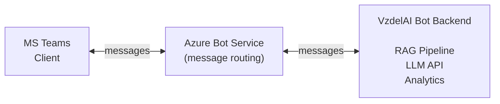
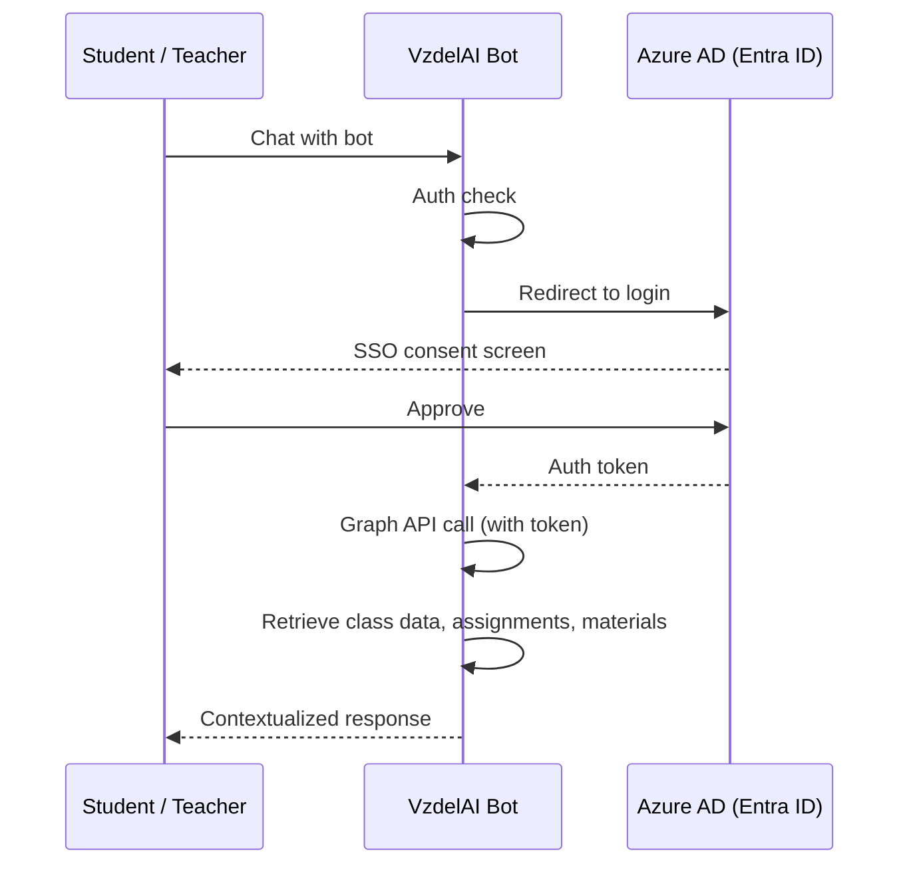
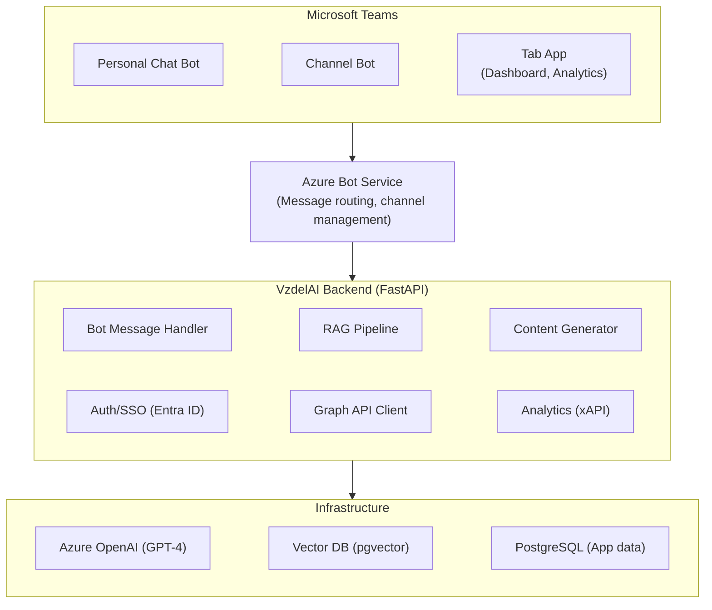

# 04 — MS Teams / Microsoft Education Ecosystem Integration

> Detailed analysis of the Microsoft Education ecosystem, Copilot for Education capabilities, and technical integration options for VzdelAI via MS Teams.

---

## 1. Microsoft Education Ecosystem Overview (2025–2026)

Microsoft has positioned its education stack as a tightly integrated ecosystem centered on Microsoft 365 and Teams:

```mermaid
flowchart TD
    subgraph eco["Microsoft Education Ecosystem"]
        direction LR
        teams["Microsoft Teams<br>(Hub)"] ~~~ m365["Microsoft 365 Apps<br>(Word, PPT, OneNote, Excel)"] ~~~ copilot["Copilot for Education<br>($18/user/mo)"]
    end
    subgraph graph["Microsoft Graph API"]
        direction LR
        g1["Education API"] ~~~ g2["Users"] ~~~ g3["Groups"] ~~~ g4["Assignments"]
    end
    subgraph azure["Azure Cloud Services"]
        direction LR
        a1["Azure OpenAI"] ~~~ a2["Azure Bot Framework"] ~~~ a3["Azure AD (Entra)"]
    end
    eco --> graph --> azure
```

### Key Ecosystem Components

| Component | Role | Relevance to VzdelAI |
|-----------|------|----------------------|
| **Microsoft Teams** | Communication hub for classes | Primary delivery channel for AI assistant |
| **Microsoft 365 Education** | Productivity suite (Word, PPT, OneNote, Excel) | Content creation and integration |
| **Copilot for Education** | AI assistant embedded in M365 | Competitive reference; potential complementary tool |
| **Microsoft Graph API** | Unified API for M365 data | Access to classes, assignments, grades, roster |
| **Azure OpenAI Service** | Managed GPT-4/5 access | LLM backend with EU data residency options |
| **Azure Bot Framework** | Bot development platform | Custom bot deployment within Teams |
| **Entra ID (Azure AD)** | Identity and access management | SSO and role-based access for university users |
| **Intune for Education** | Device and app management | Deployment and compliance management |

---

## 2. Copilot for Education — Feature Analysis

### 2.1 Current Capabilities (2025)

Microsoft launched **Copilot for Education** as a specialized AI offering for educational institutions:

**Pricing:** $18/user/month (available from December 2025)

#### Teacher-Facing Features

| Feature | Description | Status |
|---------|-------------|--------|
| **Teach Module** | Unified interface for lesson planning, resource creation, differentiation, and assessment | Available (2025) |
| **Lesson Planning** | AI-generated lesson plans aligned to curriculum standards | Available |
| **Rubric Generation** | AI-assisted rubric creation for assignments | Available |
| **Content Differentiation** | Adapt materials for different student levels | Available |
| **Quiz/Assessment Creation** | Generate formative assessments from content | Available |
| **Word Integration** | AI writing assistance for creating worksheets, handouts | Available |
| **PowerPoint Integration** | AI-generated presentation slides from lesson plans | Available |
| **OneNote Integration** | Content organization and student notebook support | Available |

#### Student-Facing Features

| Feature | Description | Status |
|---------|-------------|--------|
| **Study and Learn Agent** | AI agent for revision, practice, and conceptual understanding | Preview (Jan 2026) |
| **Reading Coach** | AI-powered fluency and comprehension practice | Available |
| **Math Solver** | Step-by-step math problem solving | Available |
| **Learning Zone** | Content shared from teacher's Copilot, shareable via Teams | Available |

#### Upcoming Features (2026)

| Feature | Expected | Description |
|---------|----------|-------------|
| **LMS Integration** | Spring 2026 | Copilot embedded within LMS environments |
| **Learning Analytics** | 2026 | AI-powered insights on student engagement and progress |
| **Parent Dashboard** | TBD | Parent visibility into student AI interactions |

### 2.2 Implications for VzdelAI

**Copilot for Education is NOT a replacement for VzdelAI**, but rather a complementary tool:

| Aspect | Copilot for Education | VzdelAI |
|--------|----------------------|---------|
| **Scope** | General-purpose M365 AI | Domain-specific educational AI (Economics, Finance) |
| **Knowledge base** | General web knowledge | University-specific course materials (RAG) |
| **Customization** | Limited (Microsoft-controlled) | Fully customizable prompts, knowledge bases, pedagogy |
| **Pedagogy** | Generic assistance | Socratic method, adaptive learning, discipline-specific |
| **Data ownership** | Microsoft cloud | University-controlled (hybrid cloud/local) |
| **Analytics** | M365 usage analytics | xAPI learning analytics, custom dashboards |
| **LMS integration** | Planned (Spring 2026) | LTI-based Moodle integration from design |
| **EU AI Act compliance** | Microsoft's responsibility | University's responsibility — full control |
| **Cost** | $18/user/month per user | One-time development + hosting costs |

**Key insight:** VzdelAI should be designed to **coexist with Copilot for Education**, not compete with it. The platform adds value through domain-specific RAG, pedagogical guardrails, and full data sovereignty.

---

## 3. Teams Bot Integration — Technical Options

### 3.1 Azure Bot Framework SDK

The primary method for building custom AI bots within Microsoft Teams:



**Key capabilities:**
- **Conversational AI:** Multi-turn conversations with context retention
- **Adaptive Cards:** Rich interactive UI elements (forms, buttons, images) within Teams chat
- **Proactive messaging:** Bot can initiate conversations (e.g., study reminders, assignment alerts)
- **File handling:** Students can share documents for AI analysis
- **Channel support:** Bot can operate in class channels (group) or 1:1 chats (private tutoring)

**Technology:** Bot Framework SDK v4 (Python or Node.js)

### 3.2 Teams Apps Platform

VzdelAI can be deployed as a **Teams App** with multiple capabilities:

| Capability | Use Case | Implementation |
|------------|----------|----------------|
| **Personal Bot** | 1:1 AI tutoring conversations | Bot Framework SDK |
| **Channel Bot** | Class-wide Q&A, announcements | Bot Framework SDK |
| **Tab App** | Dashboard, analytics, content viewer | React web app (iframe) |
| **Messaging Extension** | Quick AI actions from compose box | Bot Framework SDK |
| **Meeting Extension** | AI-assisted note-taking, summaries | Teams SDK |

### 3.3 Messaging Extensions

Enable AI-powered actions directly from the Teams message compose box:

- **Search commands:** Students search course knowledge base without leaving Teams
- **Action commands:** Teachers trigger content generation (quiz, summary) from selected text
- **Link unfurling:** Rich previews for VzdelAI platform links shared in Teams

### 3.4 Adaptive Cards

Rich interactive content within Teams messages:

```json
{
  "type": "AdaptiveCard",
  "body": [
    {
      "type": "TextBlock",
      "text": "Quiz: Macroeconomics Chapter 5",
      "weight": "Bolder",
      "size": "Medium"
    },
    {
      "type": "TextBlock",
      "text": "Q1: What is the primary function of a central bank?",
      "wrap": true
    },
    {
      "type": "Input.ChoiceSet",
      "id": "answer1",
      "choices": [
        { "title": "A) Setting tax rates", "value": "a" },
        { "title": "B) Controlling monetary policy", "value": "b" },
        { "title": "C) Managing trade agreements", "value": "c" },
        { "title": "D) Regulating stock markets", "value": "d" }
      ]
    },
    {
      "type": "ActionSet",
      "actions": [
        {
          "type": "Action.Submit",
          "title": "Submit Answer"
        }
      ]
    }
  ]
}
```

**Use cases for VzdelAI:**
- Interactive quizzes delivered in Teams
- Progress reports with visual charts
- Assignment feedback with expandable sections
- Study material recommendations with action buttons

---

## 4. Microsoft Graph API — Education Data Access

### 4.1 Education-Specific Endpoints

| Endpoint | Data | Use in VzdelAI |
|----------|------|----------------|
| `/education/classes` | Class roster, schedule | Identify student's courses for RAG context |
| `/education/classes/{id}/assignments` | Assignment details, due dates | Contextual tutoring aligned with current work |
| `/education/classes/{id}/assignments/{id}/submissions` | Student submissions | Feedback and analysis |
| `/education/users` | Student and teacher profiles | User management, role mapping |
| `/users/{id}/calendar` | Schedule information | Smart scheduling for study recommendations |
| `/groups/{id}/drive` | Class files (OneDrive/SharePoint) | Source materials for RAG knowledge base |

### 4.2 Permissions Required

| Permission | Type | Purpose |
|------------|------|---------|
| `EduAssignments.Read` | Delegated | Read assignments for context |
| `EduRoster.Read.All` | Application | Read class rosters |
| `Files.Read.All` | Delegated | Access course materials for RAG |
| `User.Read` | Delegated | Basic user profile |
| `ChatMessage.Send` | Application | Proactive bot messaging |

### 4.3 Authentication Flow



---

## 5. Deployment Architecture for Teams Integration

### Recommended Architecture



### Deployment Options

| Option | Infrastructure | Pros | Cons |
|--------|---------------|------|------|
| **Azure-native** | Azure App Service + Azure OpenAI + Azure DB | Full Microsoft integration, EU regions, managed services | Azure lock-in, higher cost |
| **Hybrid Azure** | Azure Bot Service + self-hosted backend | Bot routing via Azure, compute flexibility | Split infrastructure management |
| **Azure Container Apps** | Containerized backend on Azure | Scalable, Docker-based, Azure-integrated | Container management overhead |

**Recommendation for VzdelAI:** Azure-native deployment for Teams integration components; allows leveraging EU data center regions (West Europe, North Europe) for GDPR compliance.

---

## 6. Implementation Roadmap for Teams Integration

### Phase 1: Basic Bot (Months 1–2)
- Set up Azure Bot Service registration
- Implement basic conversational bot using Bot Framework SDK (Python)
- Personal chat support with simple Q&A
- Entra ID SSO for university users
- Deploy to Azure App Service

### Phase 2: RAG-Enabled Bot (Months 3–4)
- Integrate RAG pipeline with course knowledge bases
- Pedagogical prompt engineering (Socratic method)
- Graph API integration for class/assignment context
- Adaptive Cards for rich responses (quizzes, feedback)

### Phase 3: Teacher Tools (Months 5–6)
- Content generation via bot commands (quiz, summary, lesson plan)
- Messaging extensions for compose-box actions
- Tab app for teacher dashboard (React)
- File upload handling for knowledge base updates

### Phase 4: Analytics & Refinement (Months 7–8)
- xAPI event tracking from bot interactions
- Analytics dashboard in tab app
- Proactive messaging (study reminders, assignment alerts)
- Channel bot for class-wide Q&A

---

## 7. Teams App Manifest Configuration

VzdelAI would be published as a **custom Teams app** within the university tenant:

| Manifest Property | Value |
|-------------------|-------|
| **App name** | VzdelAI |
| **Description** | AI-powered learning assistant for University of Žilina |
| **Capabilities** | Bot, Tab, Messaging Extension |
| **Supported scopes** | Personal, Team, Group Chat |
| **Permission policy** | University tenant only (not public store) |
| **Data handling** | EU data residency, GDPR compliant |
| **SSO** | Entra ID (university accounts only) |

---

## References

- Microsoft. (2025). *Copilot for Education — Features and Pricing*. https://educationblog.microsoft.com/
- Microsoft. (2025). *Build Bots for Microsoft Teams*. https://learn.microsoft.com/en-us/microsoftteams/platform/bots/what-are-bots
- Microsoft. (2025). *Microsoft Graph Education API*. https://learn.microsoft.com/en-us/graph/education-concept-overview
- Microsoft. (2025). *Adaptive Cards Documentation*. https://adaptivecards.io/
- Microsoft. (2025). *Azure Bot Framework SDK for Python*. https://learn.microsoft.com/en-us/azure/bot-service/bot-service-quickstart-create-bot
- Microsoft. (2025). *Azure OpenAI Service — EU Data Residency*. https://learn.microsoft.com/en-us/azure/ai-services/openai/
- Microsoft. (2025). *Teams App Manifest Schema*. https://learn.microsoft.com/en-us/microsoftteams/platform/resources/schema/manifest-schema
