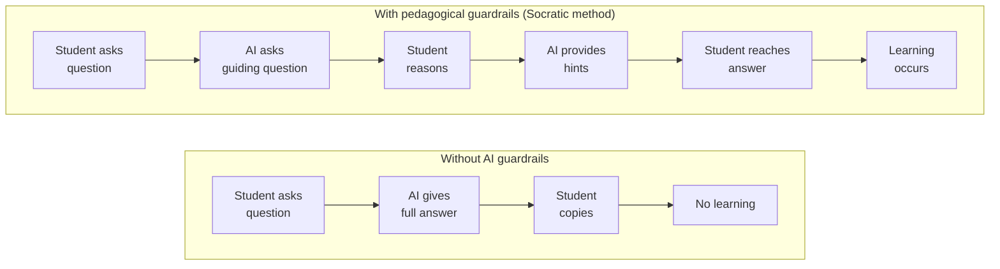
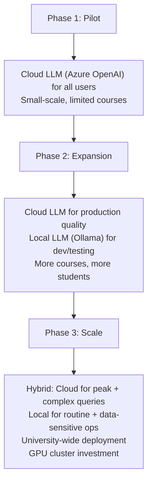
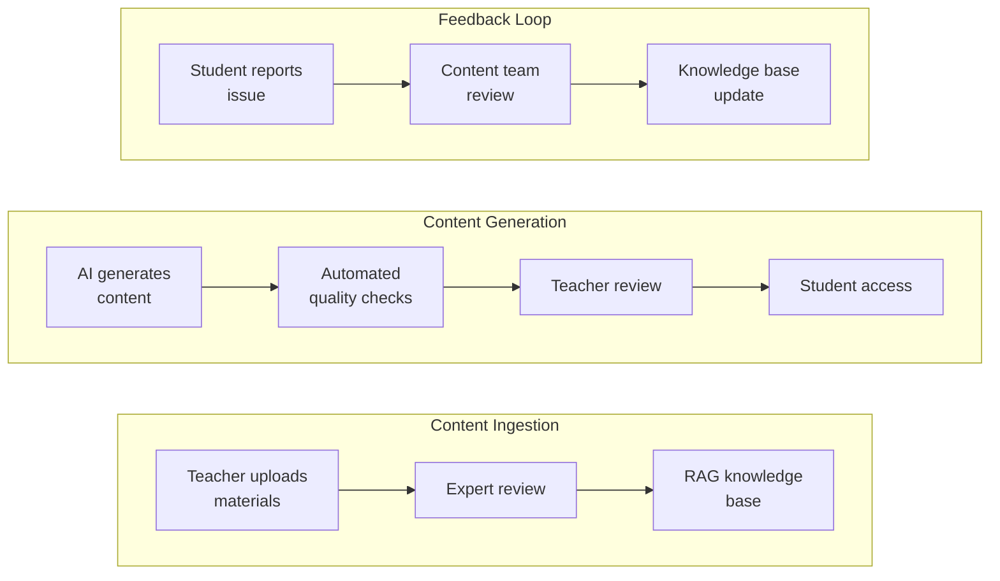

# 08 — Challenges, Risks & Lessons Learned

> Analysis of key challenges, risks, and lessons from existing AI education deployments relevant to VzdelAI.

---

## 1. Academic Integrity

### The Scale of the Challenge

| Metric | Value | Source |
|--------|-------|--------|
| College students who have used AI on assignments | **56%** (2023), **60%** (2025) | BestColleges surveys ([2023](https://www.bestcolleges.com/research/most-college-students-have-used-ai-survey/), [2025](https://www.bestcolleges.com/research/college-student-attitudes-on-ai/)) |
| Faculty who encountered AI plagiarism | **75%** | Inside Higher Ed (2025) |
| UK undergraduates who used AI tools in 2025 | **92%** (up from 66%) | HEPI/Kortext (2025) |
| Faculty time investigating AI use | Significant increase reported | Multiple surveys |

### Detection Limitations

| Tool | Approach | Limitations |
|------|----------|-------------|
| **Turnitin AI Detection** | Statistical patterns in writing | False positives for non-native speakers; accuracy drops with paraphrasing |
| **GPTZero** | Perplexity and burstiness analysis | Unreliable for short texts; easily circumvented |
| **Originality.ai** | Multi-model detection | False positives; doesn't detect AI-assisted (vs. AI-generated) writing |
| **Watermarking** | Embed detectable patterns in LLM output | Not universally deployed; can be removed |

**Key lesson:** Detection is an **arms race** that cannot be won. Better strategy: **redesign assessments** to be AI-resilient (oral exams, process-based evaluation, applied projects).

### Mitigation Strategies

| Strategy | Description | Effectiveness |
|----------|-------------|---------------|
| **AI-resilient assessment design** | Tasks requiring personal experience, real-time demonstration, original analysis | High |
| **Process-based evaluation** | Evaluate drafts, revision history, thinking process — not just final output | High |
| **Oral examinations** | Verify understanding through conversation | High |
| **AI-transparent assignments** | Allow AI use but require reflection on AI's contribution | Medium |
| **Institutional AI policies** | Clear guidelines on acceptable AI use per course | Medium |
| **Detection tools** | Turnitin, GPTZero, etc. | Low (easily circumvented) |

**Recommendation for VzdelAI:** Embed process tracking (xAPI logs of student-AI interactions) to enable **process-based evaluation** rather than relying on detection tools.

---

## 2. Over-Reliance on AI

### Evidence

| Metric | Value | Source |
|--------|-------|--------|
| Students worried about reduced critical thinking | **59%** | HEPI/Kortext (2025) |
| Students who reported decreased independent problem-solving | ~40% | Multiple studies |
| "Automation bias" — tendency to accept AI output uncritically | Well-documented | Cognitive science literature |

### The Dependency Risk

### Mitigation Strategies

| Strategy | Implementation in VzdelAI |
|----------|--------------------------|
| **Socratic method** | AI never gives direct answers; asks guiding questions (Khanmigo pattern) |
| **Scaffolded hints** | Progressive hint system: vague → specific → example → solution |
| **Metacognitive prompts** | AI asks "What do you think the answer is?" before providing guidance |
| **Usage limits** | Configurable limits on AI assistance per assignment/session |
| **Difficulty progression** | AI reduces support as student demonstrates mastery |
| **Reflection requirements** | Students must explain their reasoning, not just the answer |
| **Visible attribution** | All AI-assisted work clearly marked as such |

---

## 3. AI Hallucination

### The Problem

LLMs generate **plausible but factually incorrect** information. In educational contexts, this is particularly dangerous because students may lack the expertise to identify errors.

### Hallucination Rates

| Scenario | Hallucination Risk | Evidence |
|----------|-------------------|----------|
| General-purpose LLM (no RAG) | **High** (up to 28% inaccurate responses) | LPITutor study |
| RAG-enhanced LLM | **Low** (~6% residual inaccuracy) | LPITutor study |
| Domain where LLM has strong training data | Medium | Varies by subject |
| Niche/specialized topics | **Very high** | Common observation |
| Recent events/information | **Very high** (knowledge cutoff) | Common observation |

### Mitigation Strategies

| Strategy | Description | Impact |
|----------|-------------|--------|
| **RAG architecture** | Ground responses in verified course materials | Reduces hallucination from ~28% to ~6% |
| **Source citations** | Every AI response includes references to source documents | Users can verify claims |
| **Confidence scoring** | AI indicates confidence level; low-confidence responses flagged | Transparency |
| **Fact-checking pipeline** | Post-generation verification against knowledge base | Additional accuracy |
| **Domain boundaries** | AI explicitly declines questions outside its knowledge base | Prevents fabrication |
| **Teacher review** | AI-generated content reviewed by subject matter expert before student use | Quality assurance |
| **Disclaimer** | Clear statement that AI can make errors; encourage verification | User awareness |

**Recommendation for VzdelAI:** RAG is **mandatory** — the 72% → 94% accuracy improvement documented by LPITutor is the primary defense against hallucination. Combine with source citations and confidence scoring.

---

## 4. Faculty Resistance & Adoption

### Current Faculty Attitudes

| Metric | Value | Source |
|--------|-------|--------|
| U.S. K-12 teachers saying AI does more good than harm | Only **6%** | Pew Research Center ([2024](https://www.pewresearch.org/short-reads/2024/05/15/a-quarter-of-u-s-teachers-say-ai-tools-do-more-harm-than-good-in-k-12-education/)) |
| Faculty concerned about academic integrity | >75% | Multiple surveys |
| Faculty who have used AI in teaching | ~35% | EDUCAUSE AI Landscape Study (2025) |
| Faculty who feel adequately trained on AI | <20% | Multiple surveys |

### Barriers to Adoption

| Barrier | Description | Severity |
|---------|-------------|----------|
| **Lack of training** | Faculty don't know how to use AI tools effectively | High |
| **Academic integrity fears** | Concern that AI enables cheating | High |
| **Job displacement anxiety** | Fear that AI will reduce faculty relevance | Medium |
| **Quality skepticism** | Doubt that AI can produce accurate educational content | Medium |
| **Workload concerns** | Learning new tools adds to existing workload | Medium |
| **Pedagogical philosophy** | Belief that technology harms learning | Low–Medium |
| **Technical barriers** | Unfamiliarity with AI tools and interfaces | Medium |

### Faculty Engagement Strategies

| Strategy | Description | Priority |
|----------|-------------|----------|
| **Start with teacher tools** | Focus first on tools that save teachers time (grading, content creation) | **Critical** |
| **Demonstrate time savings** | Show concrete examples: 5.9 hours/week saved | High |
| **Provide training** | Workshops, documentation, ongoing support | High |
| **Co-design with faculty** | Involve teachers in feature design and prompt engineering | High |
| **Pilot with champions** | Find enthusiastic early adopters at Faculty PEDaS | High |
| **Maintain teacher authority** | AI suggests, teacher decides — human oversight always | High |
| **Gradual rollout** | Start simple (Q&A bot), add features incrementally | Medium |
| **Share research** | Communicate findings from academic studies on AI effectiveness | Medium |

**Key lesson from Jill Watson:** When Georgia Tech deployed Jill Watson, faculty resistance decreased once they saw that the AI TA enhanced (not replaced) their role — freeing them for complex student interactions.

---

## 5. Data Privacy & Security

### Privacy Risks

| Risk | Description | Severity |
|------|-------------|----------|
| **Cloud LLM data exposure** | Student queries sent to external APIs (OpenAI, etc.) | High |
| **Student profiling** | AI interaction data creates detailed behavioral profiles | High |
| **Data breach** | Unauthorized access to student interaction histories | High |
| **Re-identification** | Anonymized data could be re-identified from interaction patterns | Medium |
| **Third-party access** | LLM providers may access/use student data | Medium |
| **Cross-border transfer** | GDPR issues with US-based cloud services | Medium |
| **Retention** | Over-retention of student data beyond educational need | Medium |

### Mitigation Strategies

| Strategy | Implementation |
|----------|---------------|
| **Azure OpenAI (EU region)** | Keep data within EU; Microsoft DPA covers GDPR |
| **Ollama (local deployment)** | No data leaves university infrastructure |
| **Pseudonymization** | Replace student IDs with tokens before LLM processing |
| **Minimal data transmission** | Send only query + RAG context to LLM; no student identifiers |
| **Encryption** | TLS in transit; AES-256 at rest |
| **Access controls** | RBAC with principle of least privilege |
| **Audit logging** | Track all data access for compliance |
| **Retention policy** | Auto-delete interaction data after defined period |
| **DPIA** | Conduct Data Protection Impact Assessment before deployment |

→ *Detailed GDPR analysis:* [07-regulatory-compliance.md](07-regulatory-compliance.md)

---

## 6. Scalability & Infrastructure

### Local LLM Deployment Challenges

| Challenge | Details | Mitigation |
|-----------|---------|------------|
| **GPU requirements** | LLaMA 3 70B requires 40GB+ VRAM; quantized versions need 24GB+ | Start with smaller models (8B) or cloud fallback |
| **Concurrent users** | Local LLM can serve limited concurrent requests | Queue management; cloud overflow |
| **Model updates** | Keeping local models current requires manual intervention | Automated update pipeline |
| **Cost** | GPU servers (NVIDIA A100/H100) are expensive | Shared university GPU cluster; phased investment |
| **Maintenance** | GPU drivers, CUDA updates, model compatibility | Dedicated infrastructure team |

### Scaling Strategy

---

## 7. Content Quality & Accuracy

### Risks

| Risk | Description | Impact |
|------|-------------|--------|
| **Outdated knowledge** | LLM training data has a cutoff; course materials evolve | Students receive stale information |
| **Subject-matter errors** | AI generates plausible but incorrect domain-specific content | Students learn incorrect concepts |
| **Pedagogical misalignment** | AI explanation style may not match course teaching approach | Confusion, contradictory guidance |
| **Cultural/linguistic issues** | AI may not understand Slovak educational context | Irrelevant or inappropriate responses |
| **Bias** | AI may reflect biases in training data | Unfair treatment of certain students |

### Quality Assurance Process

| Quality Measure | Implementation |
|----------------|---------------|
| **Expert review of knowledge bases** | Subject matter experts validate all RAG source documents |
| **Teacher review of AI content** | All AI-generated materials reviewed before student use |
| **Student feedback mechanism** | "Report issue" button on every AI response |
| **Regular knowledge base updates** | Semesterly review and refresh of course materials |
| **A/B testing** | Compare AI responses against expert-authored responses |
| **Accuracy benchmarking** | Regular testing with known Q&A pairs per course |

---

## 8. Equity & Access

### Digital Divide Concerns

| Concern | Description | Mitigation |
|---------|-------------|------------|
| **Device access** | Not all students have equal access to devices | MS Teams mobile support; university computer labs |
| **Internet quality** | Rural students may have poor connectivity | Offline-capable features; low-bandwidth mode |
| **AI literacy** | Varying levels of comfort with AI tools | Onboarding tutorial; progressive feature introduction |
| **Language** | Non-native speakers may have different AI interactions | Multilingual support; Slovak-language interface |
| **Disability** | AI interface must be accessible | WCAG 2.1 compliance; screen reader support |
| **Economic** | Premium AI tools create two-tier learning | Institutional licensing; free access for all enrolled students |

**Key principle:** VzdelAI must be **equally accessible** to all enrolled students. No premium tiers; no feature gating based on student ability to pay.

---

## 9. Lessons from Existing Deployments

### Lesson 1: Start with Teacher Tools (Khanmigo, Copilot)
- **Observation:** Platforms that first won over teachers had more successful student rollouts
- **Mechanism:** Teachers become advocates; reduce institutional resistance
- **Application:** VzdelAI should launch teacher-facing tools (content generation, grading assistance) before student-facing features

### Lesson 2: Domain-Specific RAG Beats Generic AI (Jill Watson)
- **Observation:** Jill Watson outperforms ChatGPT in classrooms despite being less "intelligent"
- **Mechanism:** Course-specific knowledge eliminates irrelevant responses and reduces hallucination
- **Application:** VzdelAI must invest heavily in curated, course-specific knowledge bases

### Lesson 3: Socratic Method Prevents Over-Reliance (Khanmigo)
- **Observation:** Khanmigo's "never give the answer" approach maintains student agency
- **Mechanism:** Students must still think; AI scaffolds rather than replaces cognition
- **Application:** VzdelAI's default pedagogy should be Socratic questioning

### Lesson 4: RAG Accuracy Gain is Massive (LPITutor)
- **Observation:** 72% → 94% accuracy with RAG implementation
- **Mechanism:** Grounding responses in verified documents prevents fabrication
- **Application:** RAG is not optional — it is the **foundation** of VzdelAI's architecture

### Lesson 5: Transparency Builds Trust (Multiple)
- **Observation:** Students and faculty are more accepting when they understand how AI works
- **Mechanism:** Transparency reduces fear; visible limitations set appropriate expectations
- **Application:** VzdelAI should show sources, explain its reasoning, and be transparent about limitations

### Lesson 6: Phased Rollout Reduces Risk (Industry Pattern)
- **Observation:** Successful deployments start small and expand based on feedback
- **Mechanism:** Early feedback loop identifies issues before wide impact
- **Application:** Start at Faculty PEDaS with 1–2 courses → expand based on data

---

## References

- HEPI/Kortext. (2025). *Student Generative AI Survey 2025.* https://www.hepi.ac.uk/reports/student-generative-ai-survey-2025/
- EDUCAUSE. (2025). *2025 EDUCAUSE AI Landscape Study.* https://library.educause.edu/resources/2025/2/2025-educause-ai-landscape-study
- BestColleges. (2023). *56% of College Students Have Used AI on Assignments or Exams.* https://www.bestcolleges.com/research/most-college-students-have-used-ai-survey/
- BestColleges. (2025). *College Student Attitudes on AI.* https://www.bestcolleges.com/research/college-student-attitudes-on-ai/
- Pew Research Center. (2024). *A quarter of U.S. teachers say AI tools do more harm than good in K-12 education.* https://www.pewresearch.org/short-reads/2024/05/15/a-quarter-of-u-s-teachers-say-ai-tools-do-more-harm-than-good-in-k-12-education/
- Turnitin. (2025). *AI Writing Detection — Accuracy and Limitations.* https://www.turnitin.com/
- Alnawas, A., & Al-Araji, Z. (2025). LPITutor: RAG-based ITS. *PeerJ Computer Science*, 11, e2289. https://doi.org/10.7717/peerj-cs.2289
- Goel, A., & Polepeddi, L. (2018). Jill Watson. Georgia Tech. https://dilab.gatech.edu/jill-watson/
- Khan Academy. (2025). Khanmigo Design Philosophy. https://www.khanacademy.org/khan-labs
- Gallup/Walton Family Foundation. (2025). *Teaching for Tomorrow: Unlocking Six Weeks a Year With AI.* https://news.gallup.com/poll/691967/three-teachers-weekly-saving-six-weeks-year.aspx
